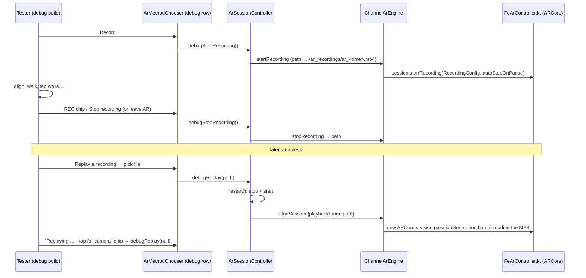

# AR recording and playback (debug rig)

Record one real room once with ARCore Recording & Playback, then replay it at a desk as often as needed: the same camera frames, IMU and tracking go through the same native and Dart pipeline (floor, corner snaps, `depthPointAt` wall taps, boards, the fit). It turns "go back to the bedroom and try again" into a repeatable test. **Android only, debug builds only** (`kDebugMode`); iOS answers `recording-unsupported` / `playback-unsupported`.

Built 2026-09-27. Not yet run on a device.

## How it fits together



## Using it

1. Build and run a **debug** build (`flutter run`, not `--release`) with `packages/fe_ar` enabled.
2. Open AR on the floor, stay on the method chooser ("How to place the model"). At the bottom, under **Debug · ARCore recording**:
   - **Record** starts recording the running session. A red **REC · tap to stop** chip shows at the top while setting up; tap it (or **Stop recording**) to finish. Leaving the AR screen also finishes the file (ARCore stops recording on pause).
   - **Replay a recording** lists the MP4s on the phone, newest first. Picking one restarts the session from it; a **Replaying … · tap for camera** chip goes back to the live camera. The replay survives a Demo toggle or retry until you go back to the camera.
3. Files live in app-specific external storage, no permission needed:

```bash
# pull every recording to the laptop
adb pull /sdcard/Android/data/com.fusionapps.fieldops/files/ar_recordings/ ./ar_recordings/
# put a recording (from another phone, or an archive) on this phone; it then shows in the list
adb push bedroom_plain_walls.mp4 /sdcard/Android/data/com.fusionapps.fieldops/files/ar_recordings/
```

Name archived recordings after the room and what they exercise (`bedroom_plain_walls_2corners.mp4`), and keep the matching model build id next to them: a replay only means something against the same model.

## What to know

- **The recording is the camera config.** During playback fe_ar keeps the recording's camera config (`pickCameraConfig` returns the session's own) and never turns the torch on.
- **A new playback file needs a new ARCore session.** `FeArController.sessionGeneration` is bumped when `startSession`'s `playbackFrom` changes, and the Compose host is keyed on it, so SceneView builds a fresh session that reads the dataset. A plain restart with the same file (or live → live) does not rebuild.
- **Time is real time.** ARCore plays the MP4 at recorded speed; a 3-minute walk takes 3 minutes to replay. Tap the same screen points at the same moments if you need identical taps (the wall taps are user input, not recorded).
- **Depth replays too.** Raw Depth and the smoothed depth image are recomputed from the recorded frames, so `depthPointAt` behaves as it did in the room (within ARCore's own run-to-run variation).
- Release builds never show the row and `debugStartRecording` / `debugReplay` return at once.

## Where

- Dart: [ar_session_controller.dart](../lib/state/ar_session_controller.dart) (`recordingsDir`, `listRecordings`, `debugStartRecording`, `debugStopRecording`, `debugReplay`), [ar_method_chooser.dart](../lib/features/ar/setup/ar_method_chooser.dart) (`_DebugRecordingRow`), [ar_setup_overlay.dart](../lib/features/ar/setup/ar_setup_overlay.dart) (REC / replaying chips).
- Engine seam: `ArEngine.startSession({recordTo, playbackFrom})`, `startRecording`, `stopRecording` ([ar_engine.dart](../lib/core/ar/ar_engine.dart)); wire in [packages/fe_ar/CHANNEL.md](../packages/fe_ar/CHANNEL.md).
- Native: [FeArController.kt](../packages/fe_ar/android/src/main/kotlin/com/fusionapps/fe_ar/FeArController.kt) (`startRecording`, `stopRecording`, `onSessionResumed`, `pickCameraConfig`), [FeArPlatformView.kt](../packages/fe_ar/android/src/main/kotlin/com/fusionapps/fe_ar/FeArPlatformView.kt) (`key(sessionGeneration)`).
