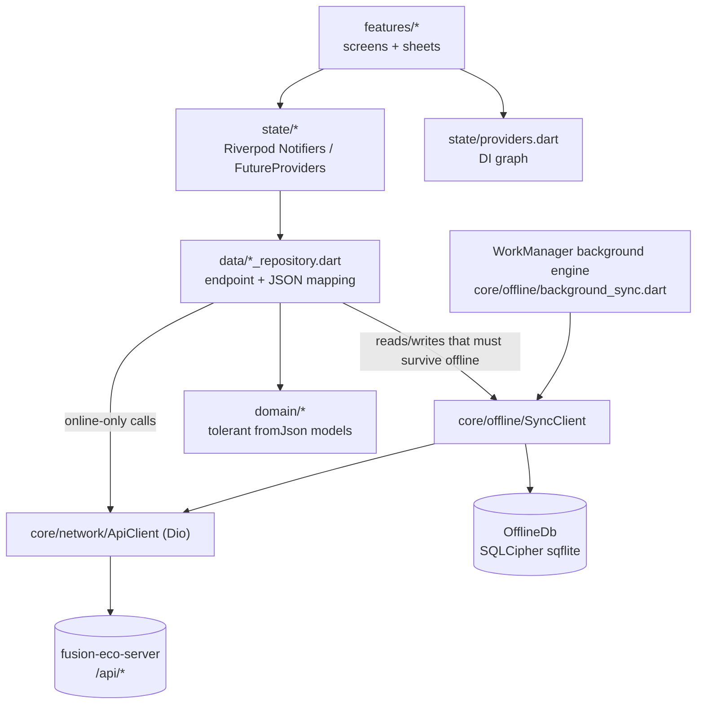
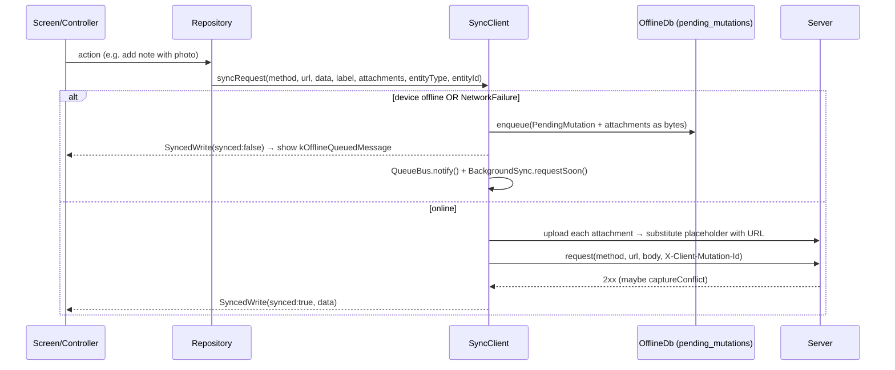
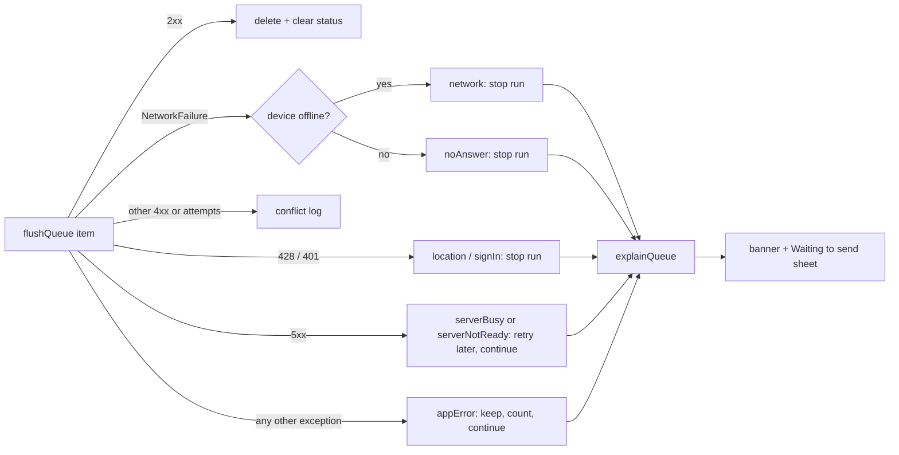
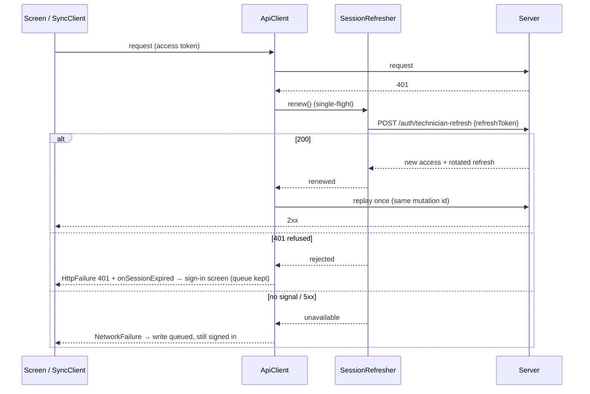
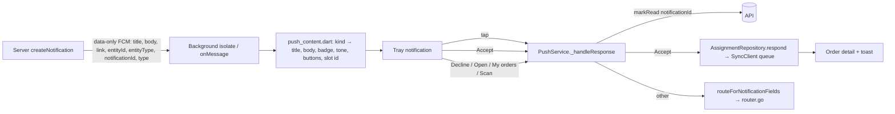

# FieldOps — Core Architecture

How the app is put together below the screens: bootstrap, dependency injection, the network layer, the offline sync engine, session and auth, the location gate, push and realtime, routing, and i18n. Feature-level flows are covered in:

- [c2o-field-verification.md](c2o-field-verification.md): scanning, asset detail, the verification capture form, route packs.
- [maintenance-orders.md](maintenance-orders.md): work orders, PM/RM/AMC, checklists, close, inspections, invites, the AI assistant.
- [build-release-and-platform.md](build-release-and-platform.md): commands, release, Android/iOS config, tests, UI/i18n conventions.

The app is the mobile port of the web technician portal (`fusion-eco-client/app/technician/*`) and talks to the same `fusion-eco-server` API. Many comments say "mirrors the web…" because behaviour is kept deliberately in step with that portal.

## Layers

- **`features/`**: one folder per screen/flow. Large screens hold their own private widgets (`_Foo`).
- **`state/`**: Riverpod 2, hand-written (no codegen): `Notifier`/`NotifierProvider`, `FutureProvider`, `StreamProvider`.
- **`data/`**: repositories. A repository takes either `SyncClient` (offline-aware) or `ApiClient` (online-only). The choice is the offline contract for that endpoint.
- **`core/`**: infrastructure (network, offline, storage, push, realtime, location, capture, OCR, C2O helpers, pure utils).
- **`domain/`**: models parsed with the tolerant helpers in [envelope.dart](../lib/core/network/envelope.dart) (`asDouble`, `asDate`, `firstNonEmpty`…), because Sequelize returns DECIMAL as strings and the API has four envelope shapes.

## Bootstrap and dependency injection

[main.dart:18](../lib/main.dart#L18) does the following in order: lock portrait → restore the saved locale → `Firebase.initializeApp` plus the background FCM handler → `SecureStore` → `SessionStore` (SharedPreferences) → DB passphrase from the keystore → `OfflineDb.open` → `ApiClient` (base URL = saved override ?? `Env.defaultApiBaseUrl`) → `BackgroundSync.init()` → `runApp` inside a `ProviderScope`.

The four stateful singletons are **built in `main()` and injected with `overrideWithValue`**. Their providers in [providers.dart:24](../lib/state/providers.dart#L24) `throw UnimplementedError()` by default. Tests and any second engine (the background sync) must construct their own instances the same way. They must never read these providers without an override.

## Network layer: `core/network/`

[ApiClient](../lib/core/network/api_client.dart#L15) is a thin Dio wrapper:

| Concern | Behaviour |
|---|---|
| Auth | `Authorization: Bearer <token>` from `SecureStore` on every request |
| Idempotency | every non-GET gets `X-Client-Mutation-Id` (UUID v4), unless the caller passed one ([:36](../lib/core/network/api_client.dart#L36)). Queued replays reuse the **original** id, so the server's idempotency guard dedupes them. |
| 401 | silent renewal + one replay (`SessionRefresher`, see "Session" below); only a **refused** renewal emits `onSessionExpired`. A renewal that can't reach the server becomes a `NetworkFailure`, so writes queue. |
| 428 | emits `onLocationRequired` → `CheckInController` raises the blocking check-in gate |
| Timeouts | connect 15s / receive 30s / uploads 120s / send 5 min ([env.dart](../lib/app/env.dart)). The send cap (2026-10-06) stops a stalled upload from holding the single flush run indefinitely. |

Every Dio error is mapped by [mapDioException](../lib/core/network/api_exception.dart#L52) into a sealed `ApiFailure`:

- **`NetworkFailure`** means no response object. It is **the only failure that ever gets queued offline.**
- **`HttpFailure(status, message, missing, body)`**: the server answered. `missing` carries the 422 close-gate fields (`["rootCause"]`, `["checklist"]`). `isAlreadyCompleted` treats a duplicate-close 400 as success, because an offline replay is not a failure. HTML bodies from a 502/504 proxy page are never shown as error text.
- **`UnknownFailure`**: anything else.

## Offline sync engine: `core/offline/`

This is the heart of the app. Technicians work in plant rooms and basements with no signal, so every write that matters goes through [SyncClient](../lib/core/offline/sync_client.dart#L73).

### Reads: `syncGet`

Reads are cache-first **only when the device reports offline**. Otherwise they go to the network and write through to `cached_entities` (TTL `Env.cacheTtl` = 24h). A `NetworkFailure` falls back to a non-expired cache entry. The cache key is URL + sorted query ([:141](../lib/core/offline/sync_client.dart#L141)). `SyncedRead.fromCache` lets screens show a "cached" hint.

[prefetchOfflineBundle](../lib/core/offline/prefetch.dart#L26) warms the cache from `GET /api/sync/manifest?technicianId=` (a list of URLs), 4 at a time, throttled to once per 4h. It is kicked from [dashboard_controller.dart:91](../lib/state/dashboard_controller.dart#L91) and forced from Profile.

### Writes: `syncRequest` and the queue

- **Attachments** (photos, voice, face captures) are stored as bytes in the row. The mutation body holds a **placeholder token** that is replaced by the uploaded URL on flush (`_substitute` JSON-encodes the body, then `replaceAll`s). Each attachment's `uploadedUrl` is persisted as soon as it lands (FR-4.7), so a retry never uploads it twice.
- **`entityType`/`entityId`** are stamped by the repository at enqueue time. They are used only to group and label the Sync Center, because URLs aren't reliably reversible. They are never sent.
- `label` is the human line shown in Sync Center and the conflict log.
- **`queueOnServerError: true`** (opt-in, added for the Snag Assistant) also parks the write when the server answers **5xx right now**, instead of throwing. Only `NetworkFailure` queues by default. A snag walk has to survive a server that answers `503 SNAG_ENGINE_NOT_ENABLED` until its migration runs. The queued 5xx then replays under the normal flush policy.

### Flush: `flushQueue`

[flushQueue](../lib/core/offline/sync_client.dart#L289) replays **oldest-first** and **stops at the first `NetworkFailure`** so ordering holds. On an `HttpFailure`, [classifyFlushFailure](../lib/core/offline/flush_policy.dart#L20) decides:

| Status | Outcome | Why |
|---|---|---|
| 428 (location gate), 401 (session) | `stopRun`: keep everything | every item behind it would fail the same way; dropping would lose a shift's valid evidence |
| other 4xx, or attempts ≥ `Env.maxMutationAttempts` (5) | `drop` → `conflicts` table (capped at 50) | replay cannot succeed |
| 5xx with attempts left | `retryLater` (bump attempts, continue) | transient |

A 2xx whose body carries `captureConflict` (FR-4.8) is recorded as a **non-dropped** conflict ("flagged" in Sync Center). The write succeeded, but the register changed while the device was offline.

**Why an item is still waiting (2026-10-06).** `flushQueue` records a `ReplayStatus` per mutation id in `SyncClient.lastReplayStatus` (in memory, rebuilt by the next flush): no signal, no answer while online (timeout or stalled upload: stops the run like no signal), 5xx (`serverBusy`), 5xx with a machine code (`serverNotReady`, e.g. `SNAG_ENGINE_NOT_ENABLED`), 428, 401 after a refused renewal, or **could not be prepared on this phone**. That last one is any non-`ApiFailure` exception. It used to escape the loop and abort every flush on the same item forever (a "poisoned" item that blocked the whole queue and never showed why). Now it is counted, kept (never auto-dropped, since it may be the only copy of evidence) and skipped so the rest drain. The pure [waiting_reasons.dart](../lib/core/offline/waiting_reasons.dart) `explainQueue` turns queue + statuses into one plain reason per item. Items behind a run-stopping item read "waiting for the change above".

The shell's banner ([offline_banner.dart](../lib/widgets/offline_banner.dart)) shows when offline. Online, it shows only when an item needs attention or has waited longer than 30 s (`shouldShowWaitingBanner`), so outbox-first saves no longer flash a bar. Tapping it opens the **Waiting to send** sheet ([waiting_to_send_sheet.dart](../lib/widgets/waiting_to_send_sheet.dart)): each item, its reason, **Retry** (`SyncClient.retryMutation` → the normal flush up to that item) and **Discard** (confirm dialog → `discardMutation`, deleted and not logged as a conflict). The banner sits inside `TopChromeLayout`, which owns the status-bar inset once and removes it from the branch screens' `MediaQuery`. Before this, the banner was drawn under the iOS status bar and each screen's own `SafeArea` added a second gap below it.

**Triggers.** Flushing is cheap to no-op, so it is called from many places:

- [`startAutoFlush`](../lib/core/offline/sync_client.dart#L122): connectivity-change listener, a **20s poll**, and an immediate run. It starts from the shell's first frame ([technician_shell.dart:56](../lib/features/shell/technician_shell.dart#L56)) and after login.
- App resume ([technician_shell.dart:71](../lib/features/shell/technician_shell.dart#L71)), a successful location check-in, the offline banner, and Sync Center "Sync all" / "Sync now" (`stopAfterId`).
- **Background** (Android only): the WorkManager one-off "soon" job queued on every enqueue, plus a 15-minute periodic job ([background_sync.dart](../lib/core/offline/background_sync.dart)).

**Single drainer.** The app and a WorkManager run are separate Flutter engines sharing one DB file. A [SyncLease](../lib/core/offline/flush_policy.dart#L49) in `sync_meta` (3-min TTL, renewed after each item) ensures only one drains at a time. A double replay is safe (server dedupe), but double **uploads** would mint duplicate files.

**UI refresh.** [QueueBus](../lib/core/offline/queue_bus.dart) emits an incrementing tick on every enqueue and after each flushed item. `queueChangedProvider` → `pendingMutationCountProvider`, `pendingMutationsProvider`, `syncProgressProvider` and `syncConflictsProvider` all re-read from it. The tick must change every time: a constant value would collapse into an equal `AsyncValue` and Riverpod would stop notifying.

### Local database

[OfflineDb.open](../lib/core/offline/offline_db.dart#L660) opens `fusion_eco_offline.db` (SQLCipher) at **schema version 10**:

| Table | Holds |
|---|---|
| `pending_mutations` | the write queue (+ `attachments_json`, `entity_type/id`) |
| `cached_entities` | GET cache (url → body, TTL) |
| `sync_meta` | key/value: `lastPrefetchAt`, `flush_lease` |
| `conflicts` | dropped / flagged writes (cap 50) |
| `c2o_assets` | resolved C2O assets for offline scan (by id **or** `asset_reference_id`) |
| `tag_issue_reports` | local-only "tag missing/unreadable" reports (FR-1.7, no server field yet, SR-6) |
| `verification_drafts` | autosaved capture forms (FR-4.2) |
| `route_packs` | downloaded route packs (FR-5.1, SR-2 stamp) |
| `snags` | Snag Assistant local store: the whole snag as JSON, plus `building_id`, `survey_id`, `status`, `local_only`. Written **before** any network call ([docs/snag-assistant.md §6](snag-assistant.md#6-app-architecture)) |
| `snag_surveys` | Snag walks and surveys, including room sweeps (coverage) |
| `ar_manifests` | AR floor packs (v10): the manifest JSON as received, its ETag, the tile hashes it references, and local meta (building name, focus board). Keyed on `(scope, scope_id)` |
| `ar_tiles` | index of tile GLB **files** (`<appSupport>/ar/tiles/<sha256>.glb`): path, bytes, last used (LRU GC). Never the bytes themselves |
| `ar_features` | feature rows per build (`featureId` → GlobalId, asset, bbox), indexed by GlobalId and asset for "Show in AR" |
| `ar_markers` | boards per floor; `local_only = 1` for a spare bound on this phone and not yet confirmed (survives a pack refresh) |
| `ar_corners`, `ar_grid_lines` | corner-snap candidates and structural grid lines per floor |
| `ar_progress` | element progress per floor; `pending = 1` rows are ahead of the server and win over a refresh |
| `ar_prefs` | small per-device AR settings: the Demo flag, the remembered setup method per floor |

**Schema change rule:** bump `version`, add the DDL to `onCreate`, **and** add an `if (oldVersion < N)` step to `onUpgrade` (each step is commented with its FR). `PendingMutation.fromRow` still reads the pre-v6 single-attachment columns, so a queue captured on an old build survives the update. Keep that kind of back-compat for queued rows.

The **passphrase** is a random 256-bit value minted once into the platform keystore ([secure_store.dart:47](../lib/core/storage/secure_store.dart#L47)). The background engine uses the read-only `readDbPassphrase()` and **must never mint one**: a second passphrase would make the real DB unreadable. The background run also **never closes the DB**, because sqflite shares one native connection per file across engines.

## Session, auth and permissions

- **Login:** `POST /api/auth/technician-login` (username or email, plus `refresh: true`) → `token` into `SecureStore`, `technician` → [Session](../lib/core/storage/session_store.dart#L7) into SharedPreferences. `Session.userId` (UUID) is what every `/technician/:id` call takes. `technicianId` (TECH001) is display only.
- **Partner accounts are refused:** a non-`in-house` `partnerRole` is logged straight back out ([login_screen.dart:46](../lib/features/login/login_screen.dart#L46)). Partners use the web `/partner/*` portal.
- **Permissions** come from `GET /api/auth/config` (raw, un-enveloped). Only six fields reach the UI. `isAiAgent`/`isCreateAsset`/`isAssetReport` are opt-in (default false). `isDigitalTwin` is **nullable** and opt-out: only an explicit `false` hides "View in 3D".
- **Base URL override:** the login screen can save a custom API host (`apiBaseUrl` pref). Both `main()` and the background engine honour it.

### Long sessions: signed in until you sign out (2026-10-06)

The owner: "make the technician login session longer so it doesn't ask for a password every time and logs in automatically until they manually log out." Until then the app ended every session after 24h three ways (the saved timestamp, `Session.isExpired`, an in-app timer), the server's token also lasted 24h, and **any** 401 signed the technician out. All three are gone.

- **Tokens.** With `refresh: true` the server (≥ 2026-10-06, `fusion-eco-server` [technician-session-refresh.md](../../fusion-eco-server/documentation/technician-session-refresh.md)) answers with a **1 h access token** and a **refresh token** (`ftr1.<sessionId>.<secret>`). It stores only a hash, **rotates** it on every use, honours the just-replaced one for a 24 h grace (a lost response in a basement), revokes the whole session if an older one comes back, and revokes it on sign-out. It expires after 90 days unused (sliding). Both tokens live in the keystore (`SecureStore`: iOS Keychain / Android EncryptedSharedPreferences), never in prefs.
- **Renewal** ([session_refresher.dart](../lib/core/network/session_refresher.dart), single-flight): `POST /api/auth/technician-refresh {refreshToken}`. 200 → new pair stored. 400/401/403 → **rejected**. No answer or 5xx → **unavailable** (keep everything). 404 (route missing) → fallback below.
- **Older server fallback.** A server that sends no refresh token gets the 24h token as before. The app then keeps the sign-in name + password **in the keystore only** and signs itself back in when that token runs out. They are deleted on sign-out, when the server refuses them (password changed), and as soon as the server issues a refresh token. This is what keeps the dev server (older code) from asking for the password daily until it is redeployed.
- **On a 401** ([api_client.dart](../lib/core/network/api_client.dart)): renew, then replay the request once with the same body, the same `X-Client-Mutation-Id` and a cloned `FormData`. A visibly expired JWT is renewed **before** sending, so an upload isn't sent twice. If the replay still gets 401, the route refuses this user for another reason: the error goes to the caller and there is no sign-out. **Rejected** → `onSessionExpired` → `AuthController` signs out (`logout(revoke: false)`) → the "session expired" dialog → login. **Unavailable** → `NetworkFailure`, so `SyncClient` queues the write and nobody is signed out.
- **The queue survives** a refused renewal: `logout()` keeps `pending_mutations` (NFR-1) and `wipeForSignOut` keeps unsent work (P-002). A flush that meets a 401 stops the run and keeps everything (`flush_policy.dart`).
- **Manual sign-out** calls `POST /api/auth/technician-logout` (best effort, 5 s) to revoke the refresh token, then clears the token, the refresh token and any keystore login.
- **Other token holders.** The socket authenticates once per connection. `socket_controller.dart` reconnects with the new token on `ApiClient.onSessionRenewed`, and connects with `ApiClient.freshToken()`. The twin WebView also takes `freshToken()`. The Android background engine builds its own `ApiClient`, so it renews too. The grace window covers it and the app racing for the same refresh token.

> Resolved 2026-10-06: the "known risk" that logout on the 24h timer or any 401 discarded unsynced work was fixed on 2026-09-27 (NFR-1, P-002). The 24h timer and logout-on-any-401 are now gone too. Still open: a *different* technician signing in on the same phone replays the previous one's queue under their own token (improvements #11).

## Location check-in gate

The server rejects every **mutating** request from a technician whose last GPS fix is older than 24h with **428 `LOCATION_REQUIRED`** (`fusion-eco-server` `middleware/auth.ts`; GETs pass).

1. The login response's `requestLocation` flag is persisted on `Session`, so a pending prompt survives a restart.
2. [CheckInController](../lib/state/checkin_controller.dart#L41) starts `required` from that flag and flips it back on for any `onLocationRequired` (428).
3. [LocationCheckInGate](../lib/widgets/location_checkin_gate.dart#L21) wraps **every route** (mounted in `MaterialApp.router`'s `builder`). While the gate is `required`, the UI is `AbsorbPointer`'d under a non-dismissible card.
4. `checkIn()` gets a medium-accuracy fix (10s, falls back to the last known position) → `POST /api/fm/technicians/me/location` → clears the flag → **resumes `flushQueue`**, which had stopped on the 428.

## Push and realtime

- **FCM** ([push_service.dart](../lib/core/push/push_service.dart)): server pushes are **data-only**, so the app draws every notification itself ([local_notifications.dart](../lib/core/push/local_notifications.dart), channel `fcm_default_channel`, custom `notification_ting` sound). The background handler is a top-level `@pragma('vm:entry-point')` function that re-inits Firebase. Listeners attach once per process; the device token is sent (`POST /api/notifications/register-device`, server upserts) on login, on every cold start with a session, and on every app resume (`PushService.syncToken`), so a missed first attempt (iOS APNs token not ready, offline) or a second user on the same phone heals itself. It is **deliberately not unregistered on logout**: phones are personally issued, so an overnight assignment should still ring.
- **What a notification shows** (since 2026-10-07, [push_content.dart](../lib/core/push/push_content.dart), pure and tested in `test/push_content_test.dart`): the server's `message` as an expandable body (the payload key is `body`; before this date only the title reached the phone), a short kind badge ("Job offer", "New job", "Action needed", …), a tone colour (red for `warning`/`error`), and up to two buttons. The kind comes from `entityType` + `title`; there is no kind key on the wire. One record keeps one tray slot: the id is an FNV hash of `<entityType>:<entityId>` (invites and their withdrawal share `order:<id>`), so a newer event replaces the older banner. Button and badge text is in a const en/ar table in that file, because the background isolate has no widget tree; the language is read from flutter_localization's SharedPreferences key.
- **Buttons** (all open the app; `PushService._handleResponse` runs them signed in):

  | Kind | Buttons | What they do |
  |---|---|---|
  | Invite (WO / PM / RM) | Accept · Decline | Accept = `AssignmentRepository.respond(accept: true)` (queues offline), then the job opens with a toast; a refusal opens the inbox with the server's reason. Decline opens the inbox (a reason is required). Annual has no respond route, so only "View invite". |
  | New work, at risk (WO / PM / RM / AMC / inspection) | Open job · My orders | Detail route / orders tab |
  | C2O route | View route · Scan tag | `/c2o-routes` / scanner |
  | Snag, permit, AR install, certification | Open … | Same as a tap |
  | Invite withdrawn, anything else | — | Tap only |

  Any tap or button also marks the `notificationId` row read and refreshes the bell.
- **Tap routing:** push data and in-app notifications both go through one function, `routeForNotificationFields` in [notification_route.dart](../lib/core/utils/notification_route.dart) (until 2026-10-07 there were two copies). It maps `link` (a web `/technician/...` path, minus the prefix) or `entityType` + `entityId` to an app route. A tap with nowhere to go opens the notifications list.

- **Socket.io** ([socket_service.dart](../lib/core/realtime/socket_service.dart)): one event, `new_notification`, only while the app is running. The URL is the API base with `/api` stripped. The socket is opened and closed by auth state in [socket_controller.dart](../lib/state/socket_controller.dart) and held by the shell, so the bell updates on any screen.

## Routing: `app/router.dart`

- Paths **mirror the web technician routes** without the `/technician` prefix, so server deep links map 1:1.
- Five bottom-nav branches (`dashboard`, `overview`, `orders`, `invites`, `profile`) live in a `StatefulShellRoute.indexedStack`. **Switch to them with `context.go`, never `push`.** Pushing one reserves its branch navigator key twice and crashes with `!keyReservation.contains(key)` ([router.dart:108](../lib/app/router.dart#L108)).
- Every other screen is a root-navigator route (`parentNavigatorKey: _rootKey`).
- **Only serialisable strings cross the router.** Use path and query params built by the `Routes.*` helpers, never `extra`.
- AR (2026-09-26): `/ar`, `/ar/marker/:code`, `/ar/session`, `/ar/install`, `/ar/install/:code` and `/ar/spare/:code` are root routes built by `Routes.ar*`. The session re-reads the floor pack itself, so only ids and codes travel. Table and params: [ar-implementation.md §4](ar-implementation.md#4-routes-and-entry-points-c9).
- The auth redirect is driven by a `ValueNotifier` bumped only when `isAuthenticated` flips.

## i18n

JSON locales (`assets/i18n/en.json`, `ar.json`) via `flutter_localization`, looked up as `'namespace.key'.getString(context)`. Arabic is RTL, and `Directionality` is pinned explicitly in [app.dart:73](../lib/app/app.dart#L73). **[LocaleController](../lib/state/locale_controller.dart#L39) is the only code allowed to call `FlutterLocalization.translate`**, and widgets must watch it rather than read the package singleton. See the bug history in that file's doc comment: the language used to revert to English after switching tabs. To add a language, see [locale_config.dart](../lib/app/locale_config.dart#L4).

## Configuration

[Env](../lib/app/env.dart) is compile-time (`--dart-define`): `API_BASE_URL`, `WEB_BASE_URL` (the Next.js client, used only to recognise scanned links as ours and to open `/public/*` pages in the in-app browser), and `BRAND_NAME`. It also holds the tuning constants: timeouts, `cacheTtl` 24h, `maxMutationAttempts` 5, `prefetchThrottle` 4h. **The committed defaults point at a LAN dev server (`192.168.0.142`).** Release builds must pass the hosts explicitly. See [build-release-and-platform.md](build-release-and-platform.md).
