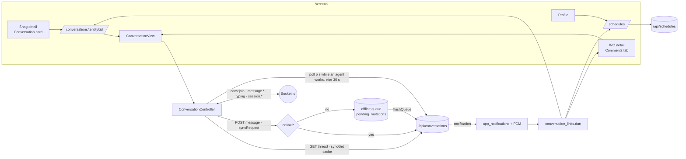

# Conversations, @agent and schedules (FieldOps)

Built 2026-09-30. This is the field side of two specs:
- `../docs/superpowers/specs/2026-09-30-agents-in-conversations.md` ("Contract changes (server)");
- `../docs/superpowers/specs/2026-09-30-orchestrator-and-schedules.md` ("Field side" and "## Contract (server)" C1–C4).

Server reference: `../fusion-eco-server/documentation/conversations.md`. The types are in `src/services/conversations/types.ts` and `src/services/schedules/types.ts`.

**Status:** `flutter analyze` is clean and 66 new tests pass (Flutter 3.47.5). None of it has been run against a live server or on a device yet.

## What the technician gets

- **A thread on every snag and work order.**
  - Snag detail: a Conversation card with the newest two messages, the unread count and "AI working on this · 0:42". It opens `/conversations/snag/<id>`.
  - Work-order detail: a new **Comments** tab (the 4th).
  - Snag comments *are* the conversation, because the server stores the thread in the snag's `activity`. The old comment box is gone, and the Activity timeline now shows only life events.
- **Agents as teammates.**
  - Agent messages have a violet ring and an "AI" tag, and the agent's role is shown ("picks the right specialist").
  - Grounding shows as "Checked against your data · 9 of 9", with "claims left out" and "Not in the data: WO-999" when they apply.
  - The routing line reads "Routing to Visual Inspector (photos)".
  - Action cards are read-only. A suggested card shows **"Needs an admin's OK"**, because the server's `canApproveCards` is Admin-only and the cards route answers 403 to a technician.
- **@mention picker.**
  - `@agent` (Flow Agent, "picks the right specialist") is always first, then specialists, then people.
  - Agents are offered only when the server says `canMentionAgents` (Admin + Technician by default).
  - Offline, the picker falls back to the thread's participants.
- **Reply**, one level deep: answering a reply answers its parent. Long-press a message for Reply, Copy, or Delete (your own).
- **Agent working.** A Working card is pinned above the composer. It shows the elapsed time, the routing line, one row per specialist with its live stage, and **Stop** (for the requester, or when the server says `canStop`).
  - The elapsed time counts from the server's `elapsedMs`, so a phone with the wrong clock still shows the right time.
- **Clarify.** When the Flow Agent asks one question, the **Answer** button starts a reply with `@agent ` in the box.
- **Schedules.**
  - Typing "@agent remind me every Monday at 8 to…" posts a normal message; the server creates the schedule. There is a quick chip for this, and a hint appears if you type reminder wording without `@agent`.
  - The Schedule card shows in the thread.
  - One-click follow-ups under a Flow Agent reply (e.g. "Check this again tomorrow at 09:00") call `POST /api/schedules` with the server's draft.
  - **My schedules** (Profile → My schedules, `/schedules`, `/schedules/<id>`) shows each schedule's cadence, next run and last result, with Pause/Resume, Run now / Try again and Delete.
- **Notifications** use the existing list and the existing FCM push. See "Notifications" below.

## Map

| Piece | File |
|---|---|
| DTOs (tolerant parsing) | `lib/domain/conversation.dart`, `lib/domain/user_schedule.dart` |
| Mention rules, picker order | `lib/core/conversation/mention_parser.dart` |
| Rows: day/unread dividers, grouping, replies, merge | `lib/core/conversation/thread_layout.dart` |
| Outgoing states (sending/queued/failed) | `lib/core/conversation/conversation_outbox.dart` |
| Cadence words ("Every Monday 08:00"), next run | `lib/core/conversation/cadence_text.dart` |
| Notification → screen (shared by list + push) | `lib/core/conversation/conversation_links.dart` |
| API | `lib/data/conversation_repository.dart`, `lib/data/schedule_repository.dart` |
| State (socket + polling) | `lib/state/conversation_controller.dart`, `lib/state/schedules_controller.dart` |
| Socket rooms | `lib/core/realtime/socket_service.dart` (`joinConversation`, re-join on reconnect) |
| UI | `lib/features/conversation/**`, `lib/features/schedules/my_schedules_screen.dart` |
| Tests | `test/conversation_*_test.dart`, `test/schedule_cadence_test.dart` |

## Offline

- **Reading.** The thread GET goes through `syncGet`, so a thread opened once opens again with no signal. It comes from the 24 h cache, and a "saved copy" strip is shown.
- **Posting.** Posts go through `syncRequest` with entity type `conversation` and entity id `<entity>:<record id>`.
  - With no signal, the message parks in the offline queue and shows "You're offline — this will send by itself when there's signal". It survives an app restart: the controller re-reads the queue, and the Sync Center lists it too.
  - A 4xx/5xx shows "Not sent: <reason>" with **Retry** and **Discard**. That message is kept in memory only.
  - `queueOnServerError` is off on purpose. A chat line with an `@agent` in it that replays an hour after a server error would start a session nobody expects.
  - Every message carries a `clientId`, minted once. The server echoes it, so a retry or replay never shows twice.
- **Online only:** mention search, follow/mute, delete, Stop, and all of `/api/schedules`. Offline, these say so ("Schedules need a connection").

## Live updates

- **Socket room** `conv:<entity>:<id>`. The app joins on open and leaves on close, and every open room is re-joined on each `connect`, because rooms are lost on a reconnect. Events handled: `message.created`/`updated`, `typing` (agent stage and people typing), and `session.started`/`updated`/`finished`.
- **Polling** is the backstop. The server drops emits from a stand-alone worker process, and phones lose sockets.
  - The thread polls every 5 s while a session is queued or working, and every 30 s otherwise.
  - Pull-to-refresh and app resume also refresh it.
  - The unread divider is fixed at the first load, so polling, which marks the thread read, doesn't move it.
- The snag card loads with `markRead=false`, so looking at a snag never clears its unread count.

## Notifications

The **push already exists** (FCM, data-only, `LocalNotifications` draws the banner), and the server sends these notifications through `notificationService`. That means push *and* the in-app list both work, with no new channel.

`conversationRouteFor()` runs first in **both** `routeForNotification` (the list) and `_routeForPushData` (a tray tap). Without it, the server's web-admin links (`/facility-management/…`) would be dropped as "not a technician link".

| entityType | Opens |
|---|---|
| `conversation:snag:*` | `/conversations/snag/<id>?message=<mid>` |
| `conversation:work_order:*` | `/orders/work-order/<id>?tab=comments&message=<mid>` |
| `conversation:<other>:*` | `/conversations/<entity>/<id>?message=` |
| `session:started\|done` | the technician link (`/technician/snags/<id>?message=` → snag → thread), or the thread from a web link |
| `schedule:started\|done\|failed` | the origin thread when the link names one; `/technician/schedules/<id>` → `/schedules/<id>`; otherwise `/schedules?focus=<id>` |

- In the list, these types get their own look: agent replies and schedules in violet, mentions and messages in blue, failed schedules in red.
- On app resume, the bell count and an already-loaded list refresh, as a backstop for anything the socket missed.

## What was only simulated / not verified

- **No live server run.** Every shape comes from the server's `types.ts` and the spec's contract sections, and was checked only by parsing tests.
- **No device run.** Things a real phone must prove:
  - keyboard and composer behaviour;
  - the 4-tab bar on a small phone;
  - the socket re-join after a network hop;
  - a queued message replaying after airplane mode;
  - an FCM tap on a `conversation:*` push opening the right thread;
  - the Arabic layout.
- Widget tests cover the message tile, working card, schedule card and picker at 320 pt in EN and AR. The full thread screen, the snag card and the WO tab have **no** widget test.
- Sockets, polling and the offline queue are exercised only through pure seams (`ConversationOutbox` with a fake poster). `ConversationController` has no test of its own.

## Not built (owed)

- Attachments in the composer. The server accepts `{url,name,type}`; the app would need `QueuedAttachment` uploads.
- Editing your own message (`PATCH`). Delete is built.
- The global "N agents working for you" indicator (`GET /api/flow-agents/active?mine=true`, `agentwork:changed`), and list-row "AI working" badges.
- Live refresh of My schedules from `schedule:changed` / `schedule:run` (it refreshes on pull and open instead).
- Schedule run history (`GET /api/schedules/:id/runs`). The repository method exists; there is no screen.
- Editing a schedule's time, and "also notify".
- Threads for service requests, PM plans, inspections, permits and assets inside their own screens. They open in the stand-alone thread screen from a notification, but there is no entry point on those records.
