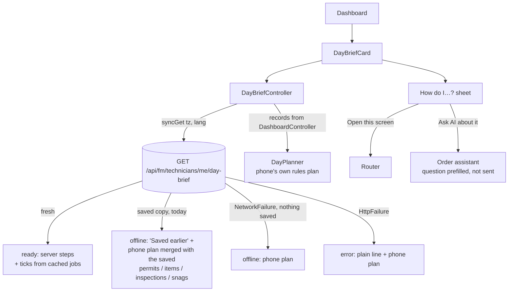

# Your day — AI summary, day plan and "How do I…?" (home screen)

Built 2026-10-10 for the owner's ask: *"Include in the home page an AI summary and action plans for the technicians, and possibly help them with the processes."* Plan: `../docs/fieldops-agentic-workforce-plan-2026-09.md` §2 #7 (Day Plan & Pre-Job Brief), R4 FM01. Server: `../fusion-eco-server/documentation/technician-day-brief.md`.

## What the technician sees

The **Your day** card sits at the top of the dashboard ([dashboard_screen.dart](../lib/features/dashboard/dashboard_screen.dart), [day_brief_card.dart](../lib/features/dashboard/widgets/day_brief_card.dart)):

- **Summary.** When the server's model text passed every guard: a violet "AI summary" box with a sparkle, typed in once. Otherwise a plain rules summary built on the phone from the steps ("3 jobs on your plan today. 1 overdue. Start with WO-1201."), in English or Arabic. A shimmer shows while the first brief loads.
- **The plan.** Ordered steps (5 shown, "Show all N"): number or a green tick, ref + title, chips (Invite, Inspection, Snag, PM, Safety, Overdue, Permit), the reason (a small sparkle when the model wrote it), the place. Tap a step → its screen. **Ticks come only from real status**: the server's `done`, or the phone's own cached copy of the job saying Completed — never from the model.
- **Before you go** (expand chevron): the rules items (permit state, reserved or listed parts, checklist progress, selfie / location needed to start, sign-off at close, an access note quoted from the job) plus up to 2 model reminders that passed the server's grounding (sparkle).
- **Request the permit first**: when the next job's permit isn't live, is suspended, or the job text suggests one. Button: **Open permit** (a linked permit) or **Message the office** (the job's Comments tab — FieldOps can't raise a permit itself).
- **Start next job** → the first open job. **Refresh** + "Updated N min ago" (ticks every minute).
- **How do I…?** → the guides sheet.

## States ([day_brief_controller.dart](../lib/state/day_brief_controller.dart))

| Phase | When | Shows |
|---|---|---|
| `loading` | first fetch in flight | shimmer + the phone's plan |
| `ready` | fresh server answer | server summary / steps, ticks overlaid from cached jobs |
| `offline` | `syncGet` served the saved copy, or `NetworkFailure` | "Saved earlier · HH:mm" (only if the saved brief is **today's**), the no-signal line, the phone's plan merged with what only the server knew |
| `error` | the server answered with an error (incl. 404 on an older server) | "Couldn't load your plan…" + the phone's plan |

The card **never blocks the dashboard**: it is one widget in the list, its first content is local, and pull-to-refresh starts its refresh without waiting for it (the model call can take ~10–20 s).

## Offline: the phone's plan ([day_planner.dart](../lib/core/day/day_planner.dart))

A port of the server's `dayBrief/rules.ts` over the work orders the dashboard already has (`DashboardState.records`, network or the 24 h cache — no extra request):

- In today's plan: open jobs due before tomorrow (overdue included), in progress, pending invites, completed today.
- Tiers: safety (Critical, or a strong safety word after removing routine names like "Fire Safety") → invites → SLA risk (`slaState`, resolve-by ≤ 2 h) → on hold → overdue → in progress → due today; inside a tier permit-blocked last, then priority, then due; tiers 2–5 grouped by building + floor.
- `mergeCached` lays a saved brief's permit state and rules items over matching steps and appends its still-open inspections and snags (the phone doesn't cache those lists here). Model text from a saved brief is never reused per step.
- Change the server rules and this together.

## Guides ([process_guides.dart](../lib/core/day/process_guides.dart), [process_guides_sheet.dart](../lib/features/dashboard/widgets/process_guides_sheet.dart))

Seven guides, written from the screens (labels are the strings those screens show):

| Guide | Open this screen | Written from |
|---|---|---|
| Start and close a work order | next job, else Orders | order detail offer panel, Tasks tab, checklist item sheet, verification sheet, Completed Works, close sheet |
| Submit an inspection | Inspections | inspection form (GPS, timer, signature lock, Submit Inspection, queued send) |
| Raise a snag or walk an area | Snag Assistant | hub (Quick snag, Start walk), raise screen, walk screen, duplicate guard |
| Sign on to a permit and record a gas test | Permit to Work | hub (Scan worksite QR), detail, sign-on / gas-test / stop-work sheets |
| Check in your location | Pending Sync | LocationCheckInGate (24 h, Share Location), verification sheet |
| Scan an asset or an AR board | Scanner | scanner results, AR "Scan a board" |
| When to reply to the AI teammate | next job's Comments, else My schedules | conversations-and-schedules.md |

**Ask AI about it** opens the existing order assistant ([order_chat_sheet.dart](../lib/features/order_detail/order_chat_sheet.dart), new `initialQuestion`) on the next open work order, general thread, with the question typed in but **not sent**. Hidden without the `isAiAgent` permission; with no open job it says to open a job first (the assistant is per job). Bottom-nav targets are opened with `go`, everything else with `push` (`openDayRoute`).

## Strings

All under `day.*` in `assets/i18n/en.json` and `ar.json` (120 keys). Rules reasons and items are rendered on the phone from the server's `reasonCode` / item `code` + `params`, so they are in Arabic too; only the model's own lines arrive in the language the phone asked for (`lang`). Permit type names use the existing `permits.type.*` keys. Inspection button names in the Arabic guide stay in English because that screen's buttons are not translated yet.

## Tests

`test/day_planner_test.dart` (selection, every tier, safety words vs routine names, SLA, blocked/priority/due, place grouping, rules items, merge with a saved brief, done overlay, contract parsing), `test/day_brief_controller_test.dart` (ready / saved today / saved another day / no signal / server refusal), `test/day_brief_card_test.dart` (loading, AI, offline, empty, error at 360×780 in EN and AR with the real string files; expand, start next, guides), `test/process_guides_test.dart` (every guide route registered in router.dart with and without a next job, all keys in both languages, server step routes map onto screens).

## Not verified

Never run on a device or against a live server; model text quality in Arabic unchecked; no "What's new" entry (the app has no such surface).
