# iOS builds to TestFlight

How FieldOps gets from this repo to iPhones and iPads through TestFlight, with no Mac build machine: GitHub Actions builds on a macOS runner with fastlane and uploads to App Store Connect. Written 2026-09-27. **Never run yet**: the first run is also the first time the iOS app has ever been compiled (see §9).

| | |
|---|---|
| Bundle id | `com.thefusionapps.fusioneco.technician` (Android is `com.fusionapps.fieldops`; they don't have to match) |
| Version | `CFBundleShortVersionString` = the name in `pubspec.yaml` (`1.0.1`); `CFBundleVersion` = the CI run number, or TestFlight's latest + 1 if higher |
| Minimum iOS | **15.5** (Google ML Kit text recognition requires it) |
| Devices | iPhone and iPad. AR needs an ARKit device; LiDAR models get the best corner snaps. AR is optional, the app installs everywhere |
| Workflow | [.github/workflows/ios-testflight.yml](../.github/workflows/ios-testflight.yml) |
| Lane | [ios/fastlane/Fastfile](../ios/fastlane/Fastfile) `beta` |

```mermaid
flowchart LR
  A["Run workflow<br/>(or push tag ios-v*)"] --> B["macOS runner<br/>latest stable Xcode"]
  B --> C["flutter pub get<br/>--enforce-lockfile"]
  C --> D["fastlane beta"]
  D --> D1["build number<br/>max(run no., TestFlight + 1)"]
  D1 --> D2["flutter build ios --config-only<br/>dart-defines + pod install"]
  D2 --> D3["temp keychain + Apple<br/>Distribution .p12"]
  D3 --> D4["App Store profile<br/>(API key)"]
  D4 --> D5["xcodebuild archive + export<br/>manual signing, Runner only"]
  D5 --> E["upload_to_testflight"]
  E --> F["Apple processing<br/>5-30 min"]
  F --> G["Internal testers<br/>TestFlight app"]
```



## 1. Why signing works this way

The lane signs **manually** with an Apple Distribution certificate kept as a GitHub secret, and fetches (or creates) the App Store provisioning profile through the App Store Connect API key. Automatic signing was the first idea, but it doesn't work on a fresh CI machine: an Xcode archive needs a signing identity in the keychain, and Xcode's cloud-managed distribution signing rejects API keys below the **Admin** role ("Cloud signing permission error"). A `.p12` plus an **App Manager** key works on every run and never creates a new certificate. No fastlane match, no certificates repo.

## 2. One-time setup in the Apple Developer account

You need the Account Holder or an Admin for steps 2.1, 2.3 and 2.4.

### 2.1 Register the App ID

1. [developer.apple.com/account](https://developer.apple.com/account) → **Certificates, Identifiers & Profiles** → **Identifiers** → **+**.
2. **App IDs** → **App** → Continue.
3. Description `FusionEco FieldOps`; **Explicit** Bundle ID `com.thefusionapps.fusioneco.technician`.
4. Capabilities: tick **Push Notifications**. Nothing else is needed (no ARKit capability exists; the camera is a usage string, not a capability).
5. Register.

If you ever add Push later, the next CI run's profile is regenerated automatically (the old one becomes invalid).

### 2.2 Create the app record in App Store Connect

1. [appstoreconnect.apple.com](https://appstoreconnect.apple.com) → **Apps** → **+** → **New App**.
2. Platform **iOS**; Name `FusionEco FieldOps` (must be unique on the whole App Store; if it's taken, add a suffix; the home-screen name comes from the app, not from here); Primary language English; Bundle ID: pick the one from 2.1; SKU `fusioneco-fieldops-ios`; User access Full.
3. Create. Nothing else on the listing is needed for TestFlight.

### 2.3 Create the App Store Connect API key

1. App Store Connect → **Users and Access** → **Integrations** → **App Store Connect API** → **Team Keys**. (The first time, the Account Holder must click **Request Access**.)
2. **+** (Generate API Key): name `GitHub CI`, access **App Manager**.
3. **Download API Key** (`AuthKey_XXXXXXXXXX.p8`). Apple lets you download it **once**; keep it in the password manager.
4. Note the **Key ID** (in the table) and the **Issuer ID** (above the table).
5. Base64 for the secret: `base64 -i AuthKey_XXXXXXXXXX.p8 | pbcopy`.

### 2.4 Create the Apple Distribution certificate (no Xcode needed)

On this Mac, in an empty folder, with the system `openssl` (LibreSSL):

```bash
openssl genrsa -out fe_dist.key 2048
openssl req -new -key fe_dist.key -out fe_dist.csr \
  -subj "/emailAddress=YOUR_APPLE_ID_EMAIL/CN=FusionEco Distribution/C=IN"
```

1. Developer account → **Certificates** → **+** → **Apple Distribution** → upload `fe_dist.csr` → download `distribution.cer`.
2. Convert and bundle with the private key (pick a strong password; it becomes `DIST_CERT_PASSWORD`):
   ```bash
   openssl x509 -inform der -in distribution.cer -out fe_dist.pem
   openssl pkcs12 -export -inkey fe_dist.key -in fe_dist.pem -out fe_dist.p12 -name "FusionEco Distribution"
   base64 -i fe_dist.p12 | pbcopy
   ```
   With Homebrew's OpenSSL 3 instead of `/usr/bin/openssl`, add `-legacy` to the `pkcs12` line, or the CI keychain import fails with "MAC verification failed".
3. Put `fe_dist.p12` and its password in the password manager, then delete the local `.key`, `.pem`, `.p12` and `.csr`. A team can hold only a few distribution certificates; reuse this one until it expires (1 year), then repeat this step and update the two secrets.

Keep **one** valid Apple Distribution certificate on the team if you can: when the profile doesn't exist yet, fastlane builds it from the first distribution certificate it finds.

## 3. Firebase (push) for iOS

`lib/main.dart` calls `Firebase.initializeApp()` with no options, so the app **needs** `ios/Runner/GoogleService-Info.plist` for this bundle id; the Xcode project already lists it as a bundle resource, so the build fails without it.

1. [Firebase console](https://console.firebase.google.com) → project **fusion-eco-technician** → Project settings → **Add app** → **iOS**.
2. Bundle ID `com.thefusionapps.fusioneco.technician`, nickname `FieldOps iOS` → Register → **download `GoogleService-Info.plist`**. Skip the SDK steps.
3. Either **commit it** to `ios/Runner/GoogleService-Info.plist` (like `android/app/google-services.json`, it isn't a secret: the key is restricted to the app), or put it in the secret `GOOGLE_SERVICE_INFO_PLIST_BASE64` (`base64 -i GoogleService-Info.plist | pbcopy`). The lane refuses a plist whose `BUNDLE_ID` is a different app.
4. Push delivery: developer account → **Keys** → **+** → tick **Apple Push Notifications service (APNs)** → download the `.p8`, note its Key ID. Firebase → Project settings → **Cloud Messaging** → Apple app configuration → **APNs Authentication Key** → upload it with the Key ID and Team ID. Without this the app runs but receives no pushes.

## 4. GitHub secrets and variables

Repo → **Settings** → **Secrets and variables** → **Actions**.

| Secret | Value |
|---|---|
| `ASC_KEY_ID` | API key id (2.3) |
| `ASC_ISSUER_ID` | Issuer id (2.3) |
| `ASC_KEY_P8_BASE64` | base64 of `AuthKey_….p8` |
| `APPLE_TEAM_ID` | 10-character Team ID (developer account → Membership details) |
| `DIST_CERT_P12_BASE64` | base64 of `fe_dist.p12` (2.4) |
| `DIST_CERT_PASSWORD` | the `.p12` password |
| `GOOGLE_SERVICE_INFO_PLIST_BASE64` | only if the plist isn't committed (§3) |

| Variable (Variables tab; a secret of the same name also works) | Value |
|---|---|
| `API_BASE_URL` | e.g. `https://dev.api.eco.thefusionapps.com` (no `/api` suffix; the lane rejects one) |
| `WEB_BASE_URL` | e.g. `https://dev.eco.thefusionapps.com` |
| `BRAND_NAME` | optional, default `Fusion Eco` |

The committed defaults in `lib/app/env.dart` are a developer's LAN IP, so both hosts are required; the workflow stops early if any secret is missing.

## 5. Run it

- **Manual:** Actions → **iOS TestFlight** → **Run workflow** (branch `main`). Optional input: a minimum build number.
- **Tag:** `git tag ios-v1.0.1-4 && git push origin ios-v1.0.1-4` (any tag starting `ios-v`).

Expect 25-45 min on the first run (the Filament pod is ~32 MB, ML Kit and SQLCipher add more; pods are cached afterwards). The job ends when the upload is accepted; it doesn't wait for Apple's processing.

## 6. Add testers

1. App Store Connect → the app → **TestFlight**. The build shows as *Processing*, then *Ready to Submit* / *Ready to Test* (5-30 min; Apple emails when done). Export compliance is already answered by `ITSAppUsesNonExemptEncryption = false` (see §8 on SQLCipher).
2. **Internal testing** (no review, up to 100 people who are users in your App Store Connect team): **+** next to Internal Testing → group `FieldOps QA` → tick **Enable automatic distribution** → add testers (they must first be added under Users and Access, any role).
3. **External testing** (anyone by email or public link, up to 10,000): create a group, add the build, fill **Test Information** (feedback email, what to test, and a **demo login**, since the app is login-only) → Submit for Beta App Review (first build of each version, usually < 24 h).
4. Testers install **TestFlight** from the App Store, open the email invite or link, and install FieldOps. Builds expire after 90 days.

## 7. After the first green run

- Download the `Podfile.lock` artifact from the run and commit it to `ios/Podfile.lock`, so later builds install the same pod versions.
- Record the build in [VERSIONING.md](../VERSIONING.md) like an Android upload.

## 8. Common failures

| Symptom | Cause and fix |
|---|---|
| `Missing secret or variable …` | §4 |
| `GoogleService-Info.plist is missing` / `… is for "…", the app is …` | §3: download the plist of the **iOS** app with this bundle id |
| `Could not find a valid signing identity` / `MAC verification failed` / `security: SecKeychainItemImport` | wrong `DIST_CERT_PASSWORD`, or the `.p12` was made with OpenSSL 3 without `-legacy` (2.4) |
| `No profiles for '…' were found` / sigh `Couldn't find bundle identifier` | App ID not registered (2.1), or the key lacks App Manager/Admin |
| `Provisioning profile … doesn't include the aps-environment entitlement` | Push Notifications not ticked on the App ID (2.1); re-run after ticking it |
| `Cloud signing permission error` | something switched the Runner target back to automatic signing; the lane sets manual signing on the Runner target only |
| `requires a development team` on a `…-fe_ar_assets` / other bundle target | the Podfile's `post_install` disables signing for resource bundles; make sure the committed `ios/Podfile` is used |
| `Specs satisfying the google_mlkit_… dependency were found, but they required a higher minimum deployment target` | `platform :ios` in the Podfile went below 15.5 |
| `None of your spec sources contain a spec satisfying Filament (= 1.72.1)` | fe_ar's podspec must say 1.72.0: 1.72.1 was never published to CocoaPods (same material version 72) |
| `The bundle version must be higher than the previously uploaded version` | pass a higher `build_number` input; normally the lane already takes TestFlight's latest + 1 |
| `ITMS-90683: Missing purpose string` | a plugin references a privacy API without an `NS…UsageDescription`; add the key to `ios/Runner/Info.plist` |
| `This bundle is invalid. The SDK … is not supported` / `ITMS-90725` | the runner's newest Xcode is older than Apple's minimum: change `runs-on` to a newer macOS image |
| `xcodebuild -showBuildSettings timed out` | transient on hosted runners; re-run (the workflow already raises the timeout) |
| App crashes on launch in TestFlight | open the crash in TestFlight → Crashes. First suspects: Firebase plist (§3), SQLCipher vs system SQLite (§9) |

## 9. First CI build: what to check

Nothing iOS has ever been compiled; this Mac has no Xcode. These were checked only as far as possible offline (2026-09-27):

- `ruby -c` on the Fastfile, Podfile and fe_ar podspec; `fastlane lanes` parses the Fastfile; `pod spec lint --quick` passes the fe_ar podspec; `plutil -lint` on Info.plist, the entitlements and the Xcode project; the Xcode project opens in the `xcodeproj` gem with the new resource and settings.
- fe_ar Swift type-checks with `swiftc -typecheck` against the **Mac Catalyst** SDK (ARKit, UIKit, Vision, Metal) with Flutter stubbed; `FeArRenderer.mm` syntax-checks against the **Filament 1.72.0 pod's own headers**. Real iOS SDK differences can still surface.

Watch for:

1. **Mixed SwiftPM + CocoaPods.** Most plugins build through Swift Package Manager; fe_ar, google_mlkit_text_recognition, sqflite_sqlcipher and flutter_secure_storage through CocoaPods.
2. **SQLCipher vs system SQLite.** `sqflite` (system SQLite, via SwiftPM) and `sqflite_sqlcipher` (SQLCipher pod) are both in the app. If the system library wins at link time, the encrypted DB fails to open ("file is not a database"). Check the first launch on a device; if it fails, the known fix is to drop the plain `sqflite` dependency or force SQLCipher's link order.
3. **Push on iOS is not finished in Dart.** `LocalNotifications.init` passes Android settings only (docs/build-release-and-platform.md §6); on iOS `flutter_local_notifications` may reject that, so foreground notifications may not show. Data-only FCM messages also aren't delivered to a killed iOS app. Login and everything else don't depend on it.
4. **Background sync is Android-only** (`BackgroundSync._supported`); on iOS the queue drains while the app is open. No `BGTaskScheduler` ids were added.
5. **Orientation.** iPhone lists portrait plus both landscapes, because the AR camera screen rotates to landscape at runtime (`SystemChrome.setPreferredOrientations`) and iOS only honours orientations listed in Info.plist; the rest of the app asks for portrait. iPad lists all four (App Store rule for multitasking apps), and iPadOS ignores the portrait request in Split View.
6. **Export compliance.** `ITSAppUsesNonExemptEncryption = false` skips the question per build. The app encrypts its local DB with SQLCipher (AES) for its own data; confirm with whoever owns compliance that this falls under the exemption, or change the key and answer the questionnaire.
7. **Board AprilTags (method `tag`)** on iOS: the tag search runs on Vision's queue over the captured image's luma plane (420f plane 0) with the QR corners Vision returned. Confirm Vision's corners and the tag corners land in the same unrotated buffer pixels (a wrong orientation shows as no tags ever matching), and that a lock reports `method: tag` with a spread under 10 mm. The vendored AprilTag licence (BSD-2-Clause, `packages/fe_ar/src/third_party/apriltag/LICENSE.md`) must appear in the app's acknowledgements.
8. **fe_ar on a device**: see `packages/fe_ar/README.md` slice 0 and PENDING.
