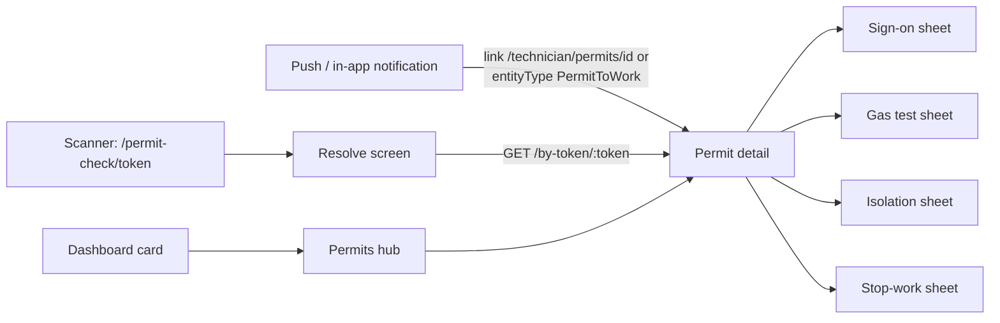

# Permit to Work (PTW)

Built 2026-09-26 (uncommitted). App module: `lib/domain/permit.dart`, `lib/core/permit/permit_gas.dart`, `lib/data/permit_repository.dart`, `lib/state/permit_controller.dart`, `lib/theme/fe_permit_colors.dart`, `lib/features/permits/*`. Server: `/api/fm/permits`, documented in `../fusion-eco-server/documentation/permit-to-work.md` (the source of truth for every rule below — this app never re-implements one). Client TypeScript contract both sides build against: `../fusion-eco-client/lib/apis/permits.ts`.

A permit to work is the written authorisation for one piece of high-risk work (hot work, confined-space entry, electrical isolation, work at height, fire-system impairment, and so on) in one place for one shift: hazards and controls, who approved it, what was isolated and proven dead, the gas test, who is on the crew, and how the area was handed back.

## 0. The one rule this app follows everywhere

**The server is the only place any PTW rule is enforced.** This app never decides whether a permit can be issued, closed, extended, approved, or whether a gas reading or an isolation is safe to accept — it renders `PermitDetail.readiness` (computed server-side by the same code that enforces it, `ptwRules.ts`) and offers exactly the one action `readiness.nextAction` names. Every other live action a technician might otherwise expect renders as "Waiting on the office: <label>" instead of a button.

The **one exception** is live gas colouring (`lib/core/permit/permit_gas.dart`): judging a reading against `GasProfile.limits` as the technician types it, purely so the gas-test sheet can flash red/green before the network round trip. The server re-judges the same reading on `POST /:id/gas-tests` and is the only source of truth for what actually gets recorded, including whether it auto-suspends the permit — a disagreement here would be a display bug, never a safety decision.

Approvals, issue and close-out are office/web actions. This app's own permits list ("My permits") has nothing to do for a `draft` permit besides watching it move — see `permits_hub_screen.dart`'s doc comment.

## 1. Screens

| Screen | File | Route | What it does |
|---|---|---|---|
| My permits (hub) | `permits_hub_screen.dart` | `Routes.permits` (`/permits`) | Live / Upcoming / Done tabs, merging the crew query and the raised query (`myPermitsProvider`) so a permit the technician both requested and is crew on appears once. |
| Permit detail | `permit_detail_screen.dart` | `Routes.permitDetail(id)` (`/permits/:id`) | Readiness lifecycle strip, blockers, gas/isolation/crew/checks summaries, the one next-action button, activity, attachments. Opens the sheets below. |
| Worksite QR resolver | `permit_resolve_screen.dart` | `Routes.permitByToken(token)` (`/permits/by-token/:token`) | Loading frame only: calls `GET /by-token/:token`, then replaces itself with the detail screen so backing out lands wherever the scan was opened from (scanner or notification), never on this frame. |
| Sign-on sheet | `sheets/sign_on_sheet.dart` | opened from detail | Briefing acknowledgement + signature pad → `POST /crew/:crewId/sign-on`. |
| Gas test sheet | `sheets/gas_test_sheet.dart` | opened from detail | O2/LEL/H2S/CO entry with live `PermitGas` colouring → `POST /gas-tests`. |
| Isolation sheet | `sheets/isolation_sheet.dart` | opened from detail | Apply / verify / restore one LOTO point → `POST /isolations/:isoId/(isolate\|verify\|restore)`. |
| Stop-work sheet | `sheets/stop_work_sheet.dart` | opened from detail | Reason capture → `POST /transition {action:"suspend"}`. Never location-gated (see §5). |
| Generic permit sheet | `sheets/permit_sheet.dart` | opened from detail | Shared bottom-sheet chrome/host for the sheets above. |
| Dashboard card | `dashboard_screen.dart` → `widgets/permit_dashboard_card.dart` | — | Same "doorway" pattern as the other module cards; opens the hub. |

Shared visuals: `widgets/permit_card.dart` (a row in the hub list), `widgets/permit_visuals.dart` (status/risk chip colours), `theme/fe_permit_colors.dart`.

## 2. Entry points and routing

- **Notification / push.** The server stamps `entityType: "PermitToWork"` on a permit notification (`ptwService.ts`) and, for a technician, a `link` of `/technician/permits/<id>`. Both `core/utils/notification_route.dart` (`routeForNotification`) and `_routeForPushData` in `core/push/push_service.dart` map the link through the ordinary `/technician` prefix strip (no special-casing needed there — CLAUDE.md's "paths mirror the web routes" rule does the work), and both also check `entityType == 'PermitToWork'` **and** `'Permit'` as a link-less fallback (the plain `'Permit'` spelling is kept only in case an older or generic notification path ever used it — the real value the server sends is `PermitToWork`). Change both files together, per CLAUDE.md's "tap routing exists twice" rule.
- **Scanner.** The worksite QR printed on a permit certificate is `https://<host>/permit-check/<token>` (any host, case-insensitive scheme/path, optional trailing slash/query/fragment — `permitCheckTokenFromScan` in `core/permit/permit_gas.dart`, mirroring `MarkerCode.fromScan`'s URL matching). `scanner_screen.dart` checks it **after** AR board codes and **before** the C2O parser and the general QR scheme (`_handleRaw`), so it shares the same "URL scheme checked early" precedence CLAUDE.md documents for AR boards, and never collides with a C2O tag or a general `{"type":"Asset",...}` payload. On a match it vibrates and does `context.pushReplacement(Routes.permitByToken(token))` — replace, not push, so the scanner can't re-read the same certificate behind the resolver frame. The token is base64url and case-sensitive, so unlike `MarkerCode` it is never upper-cased or otherwise normalised.
- **Router ordering.** `router.dart` registers the fixed segment `/permits/by-token/:token` **above** the generic `/permits/:id`, the same trap as any other `/fixed/:id` pair in this app's router.

## 3. Offline behaviour, exactly

Unlike Snag Assistant, **there is no local write-ahead state**. `SnagRepository` keeps a full local copy in SQLCipher and applies `SnagRules` optimistically offline, because a snag's rules are simple enough to port safely. A permit's `readiness` folds together approvals, gas, isolations, crew, checks, conflicts and validity — reimplementing that fold here would be exactly the drift trap §0 warns against. So `PermitRepository` (`lib/data/permit_repository.dart`) does only the two contracts the rest of the app already trusts:

- **Reads** (`catalog`, `mine`, `detail`, `byToken`) go through `SyncClient.syncGet` — network with a write-through cache, falling back to a non-expired cache entry offline (24h TTL, 7 days for the catalogue since it only changes when someone edits the PTW configuration in the office).
- **Writes** (`signOn`, `signOff`, `addGasTest`, `isolate`, `verifyIsolation`, `restoreIsolation`, `stopWork`, `completeWork`, `fireWatchDone`, `comment`) go through `SyncClient.syncRequest(..., queueOnServerError: true)`. On a `NetworkFailure` the write parks in `pending_mutations` and the technician sees `kOfflineQueuedMessage`. **The screen does not update `readiness` until the write actually reaches the server and a refresh pulls the new copy back in** — a real UX gap accepted on purpose rather than inventing a local readiness engine (see PENDING).
- On a successful write, the repository caches the server's fresh copy straight into the same cache slot `detail`/`byToken` reads from (`_cacheDetail`, keyed exactly as `SyncClient.syncGet` would key `GET /:id`), so a technician who acts while online and then loses signal a minute later still sees the post-action state offline.

**Signatures and isolation photos travel as inline data URLs, not `QueuedAttachment`s — a deliberate deviation from every other binary upload in this app.** Every other upload (`SnagRepository`, `addSignatureItem` in `checklist_repository.dart`) rides `QueuedAttachment`: bytes go to `POST /api/upload/image` and a `__pending_*__` placeholder in the JSON body is swapped for the returned **URL** at flush time. The PTW endpoints do not take a URL: `POST /crew/:crewId/sign-on` wants `{briefingAck, signature: "data:image/png;base64,…"}` and `POST /isolations/:isoId/isolate` wants `{..., photo: "data:image/…;base64,…"}` literally inline. Routing either through the upload endpoint would send the isolate/sign-on call a value the server does not accept, so both go straight into the mutation body as a data URL (`PermitRepository._pngDataUrl` / `CapturedPhoto.dataUrl`) and ride the *ordinary* queued-write path — a plain JSON `pending_mutations` row, no attachment. Offline safety is unaffected; only the encoding differs. A signature from the pad is small (tens of KB); an isolation photo is downscaled the same way every other field photo is (`downscaleJpeg`, 1600px/quality 80, `PhotoCapture.takeJobPhoto`) — which is not a guarantee it stays under any particular size, so a very detailed lock photo could still make a queued mutation row larger than the rest of this app's rows.

| Action | Repository call | Endpoint | Offline |
|---|---|---|---|
| Sign on to permit | `signOn` | `POST /:id/crew/:crewId/sign-on` | Queued; signature travels inline (above) |
| Sign off permit | `signOff` | `POST /:id/crew/:crewId/sign-off` | Queued |
| Record gas test | `addGasTest` | `POST /:id/gas-tests` | Queued; server may answer `autoSuspended: true` |
| Apply isolation | `isolate` | `POST /:id/isolations/:isoId/isolate` | Queued; photo travels inline (above) |
| Verify isolation | `verifyIsolation` | `POST /:id/isolations/:isoId/verify` | Queued |
| Restore isolation | `restoreIsolation` | `POST /:id/isolations/:isoId/restore` | Queued |
| Stop work | `stopWork` | `POST /:id/transition {action:"suspend"}` | Queued; **not** location-gated on the server (a stale GPS fix must never block "stop work"), same as every other PTW POST |
| Mark work complete | `completeWork` | `POST /:id/transition {action:"complete"}` | Queued |
| Sign off fire watch | `fireWatchDone` | `POST /:id/transition {action:"fire_watch_done"}` | Queued |
| Comment | `comment` | `POST /:id/comments` | Queued |
| Catalogue / hub list / detail / by-token | `catalog`/`mine`/`detail`/`byToken` | `GET …` | Cache-then-network, TTL as above |

## 4. Endpoints used by this app

Base `/api/fm/permits`, `decodeToken` on every route (technician session):

- `GET /catalog` — types, hazard/control/PPE labels, crew roles, gas limits (`PermitCatalog`).
- `GET /?mine=crew|raised&limit=200` — the two lists `myPermitsProvider` merges.
- `GET /:id` — full detail with `readiness`.
- `GET /by-token/:token` — signed-in worksite-QR scan → full detail (same shape as `/:id`).
- `POST /:id/crew/:crewId/sign-on` `{briefingAck, signature}` / `sign-off`.
- `POST /:id/gas-tests` `{o2?, lel?, h2s?, co?, instrumentId?, calibrationDue?, location?, note?, testedAt}` → `{permit, test, autoSuspended}`.
- `POST /:id/isolations/:isoId/isolate` `{lockNo?, tagNo?, note?, photo?}` / `verify` `{tryOut, note?}` / `restore`.
- `POST /:id/transition` `{action, reason?, comment?, note?}` — `suspend` / `complete` / `fire_watch_done` are the only actions this app sends; the rest (`issue`, `approve`, `extend`, `close`…) are office/web-only.
- `POST /:id/comments` `{text}`.

Full endpoint list, gates, numbers (validity windows, gas limits, fire-watch minutes), SIMOPS clashes and the four-eyes table live in `../fusion-eco-server/documentation/permit-to-work.md` §3–6 — this app only ever calls the subset above.

## 5. What is not built here

Mirrors the server doc's §11 plus this app's own gaps:

- No presence-proof issue, revision flow, issuer workload caps, shift-handover acceptance, BMS reconciliation, incident linkage, or permit pins on the 3D twin — none of these are FieldOps' to build; see the server doc.
- `PermitHubItem.needsSignature` (`state/permit_controller.dart`) is an approximation: `PermitSummary` carries no per-technician sign-on state, only `PermitDetail.crew` does, so "crew on a live permit" can show a false-positive reminder badge for a technician who already signed on. Fixing it needs a contract addition (a per-technician flag on the summary row).
- The offline UX gap in §3 (a queued write leaves `readiness` visibly stale until the next sync) is accepted, not fixed.
- The module has never been analyzed, tested against a real device, or run against a live server — see PENDING P-013.

## 6. Verification, be honest

**2026-09-27, real Flutter 3.47.5** (the slim SDK bootstrapped into the session scratchpad, per LEARNINGS → Platform): `flutter pub get --enforce-lockfile` (lockfile unchanged), `flutter analyze` (zero errors project-wide; zero errors *and* zero warnings in every PTW file — `lib/features/permits/**`, `lib/domain/permit.dart`, `lib/core/permit/**`, `lib/data/permit_repository.dart`, `lib/state/permit_controller.dart`, `lib/theme/fe_permit_colors.dart`, and the router/push/notification/scanner edits; only pre-existing style-level infos remain, consistent with the rest of the codebase), `flutter test test/permit_model_test.dart test/permit_gas_test.dart test/permit_routes_test.dart` (47/47 pass).

**Not run:** any widget test for the screens or sheets themselves (only the pure `domain`/`core`/route-builder logic is tested); a device run of any screen; a real server round trip for any write. See PENDING P-013 for the full list and next steps.
