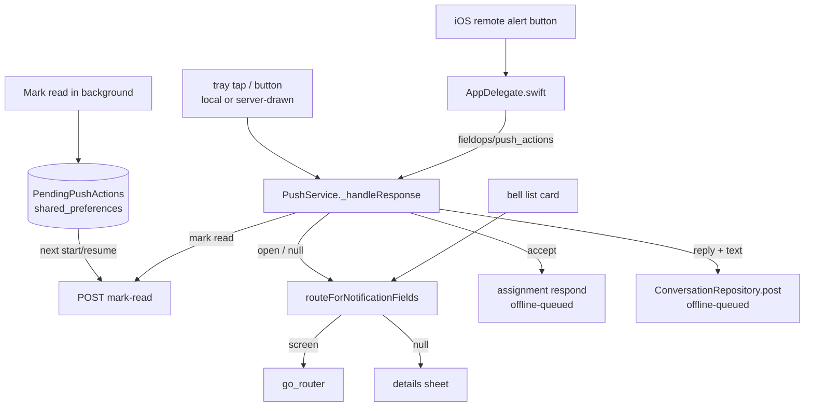

# Notifications: groups, routing, rich push (2026-10-10)

How a technician's notifications are grouped, where each one opens, what the
tray shows on Android and iOS, and what is still owed before it all works on a
phone. Server half: `../fusion-eco-server/documentation/fcm-push-notifications.md`
("Payload v2", "List API filters").

## 1. One set of rules, three places

| Rule | App (pure, tested) | Server mirror |
|---|---|---|
| kind, group, priority, buttons | `lib/core/push/push_content.dart` | `src/services/push/pushPayload.ts` |
| where a tap goes | `routeForNotificationFields` in `lib/core/utils/notification_route.dart` | — (server sends `link`/`route`) |
| list grouping, Today / Earlier, relative time | `lib/core/notifications/notice_list.dart` | `noticeGroupOf` for `?group=` |

`test/notice_catalog_test.dart` and the server's `pushPayload.test.ts` pin the
**same fixtures** (one per real server notification type). Change both sides.

## 2. Type → screen

| Server sends (`entityType`, title, link) | Group | Opens |
|---|---|---|
| `"New assignment invite"` (any order spelling) | Work | Invites inbox (Accept / Decline) |
| `"Assignment reassigned"` | Work | My orders |
| `WorkOrder`/`work_order`, `PreventiveMaintenance`, `ReactiveMaintenance`, `AnnualMaintenance` (+ snake_case) | Work | `/orders/<type>/<id>` |
| `Inspection`, `InspectionAssignment` | Work | `/inspections/<id>` |
| `c2o_route_assignment` | Work | Routes list |
| `ar_install_request` | Work | `/ar/install?floorId=` |
| `Snag` | Snags | `/snags/<id>` |
| `PermitToWork` / `Permit` | Permits | `/permits/<id>` (admin link on a technician copy → still the permit) |
| `conversation:<entity>:<mention|reply|message>` | Messages | the record's thread, scrolled to the message (WO → Comments tab) |
| `session:*` | Messages | the record (technician link) |
| `schedule:*`, `UserSchedule` | Schedules | `/schedules/<id>` or My schedules |
| `Technician` (certification) | Other | Profile |
| `Asset` | — | `/asset/<id>` |
| digest (`kind=digest`) | its group | the list on that tab |
| `c2o_finding`, `FlowAgentSuggestion` (on-call), anything unknown | Snags / Work / Other | **details sheet** (`/notifications?open=<id>`) — never a dead tap |

Order of rules: threads/sessions/schedules → a `/technician` link that maps to
a registered screen (`kAppRoutePatterns`, kept equal to `router.dart` by a test)
→ invite titles → the entity table `kNoticeEntityRoutes` → the server's `route`
→ null (details sheet). Every entry point uses this one function: tray tap and
buttons (Android, iOS local, iOS server-drawn), cold start, the list.

## 3. The notifications screen

`lib/features/notifications/` — chips: All, Work, Snags, Permits, Messages & AI,
Reminders, Other, each with its unread count (server `groupCounts` when sent,
else counted locally). Today / Earlier sections. Swipe right = mark read, swipe
left = archive (SnackBar Undo; server `archive/:id`). "Mark all read" applies to
the open tab (only when the server understands tabs). Rich card: kind icon,
priority stripe (critical red, high amber), ref chip, location, relative time,
photo thumbnail, unread dot. Quick actions: Accept/Decline (unread invite),
Reply (bottom sheet → same offline-queued post), Scan (route). Empty state per
tab. Pull to refresh; live via socket `new_notification` (row + `meta`). EN/AR,
RTL. Widget tests: `test/notifications_screen_test.dart` (375 px, en + ar).

## 4. Rich push per platform

| Feature | Android | iOS |
|---|---|---|
| Channels per group (+ critical alarm, quiet) | built (`fe_work`…, `fcm_default_channel` = Other) | n/a |
| Big text / big picture (download 6 s, 5 MB cap, fallback) | built | attachment on app-drawn banners: built |
| Photo on server-drawn alerts (app closed) | n/a (app always draws) | **NSE written, not wired** (§6) |
| Inbox summary per group, `groupKey` | built (summary once ≥ 2) | `threadIdentifier` + server `thread-id`: built |
| Digest (server folds bursts) | Inbox style: built | alert with lines: built |
| Buttons: Accept/Decline, Open, Scan, Reply (text), Mark read | built | categories built; server sends `aps.category`; remote taps via AppDelegate: built |
| Interruption level / relevance | priority + channel importance | `interruptionLevel` (local) + `interruption-level`/`relevance-score` (server): built; time-sensitive needs capability (§6) |
| Full-screen for critical | flag set; needs manifest permission (§6) | n/a |
| Badge | `number` per notification | `badgeNumber` + server `badge` + `setBadge` channel (bell count) |
| Sound | ting on every channel but quiet | `notification_ting.wav` local + server `aps.sound` |
| Progress style | not used — there is no long-running server job to show | — |

Mark read never opens the app: the background isolate (Android, iOS local) or
the app delegate (iOS remote) parks the id; `PushService.flushPendingReads`
sends it on the next start/resume.

## 5. "Notifications are not working" — checklist

Code path verified 2026-10-10: Firebase init (`main.dart`), permission,
APNs-token wait, token sent on every login/resume (`syncToken`), listeners,
background handler. External pieces:

1. **iOS plist:** present — `ios/Runner/GoogleService-Info.plist`, bundle
   `com.fusionapps.fieldops`, app `1:552357954709:ios:7e5762502536ff605d879c`
   (commit 7e6c2e4). Android `google-services.json` has `com.fusionapps.fieldops`.
2. **APNs auth key (.p8)** uploaded in Firebase → Project settings → Cloud
   Messaging → Apple app `com.fusionapps.fieldops`. Not verifiable from code;
   if missing, the server log shows `messaging/third-party-auth-error`.
3. **App ID Push Notifications capability** on `com.fusionapps.fieldops`
   (the App Store profile only carries `aps-environment` if it is on).
4. **Server secret `FIREBASE_SERVICE_ACCOUNT_JSON`** on every tenant that should
   push (the local dev `.env` has none → the API logs "FCM push disabled").
5. Deploy the server change, then `node scripts/test-push.mjs <technician>`.

## 6. Owed (not doable without Xcode / a console)

- **Notification Service Extension** (photo on iOS alerts while the app is
  closed). Source ready and type-checked: `ios/NotificationService/{NotificationService.swift,Info.plist}`.
  Not added to `project.pbxproj` on purpose: a new target that the CI can't sign
  breaks every TestFlight build. Steps on a Mac with Xcode:
  1. developer.apple.com → Identifiers → new App ID `com.fusionapps.fieldops.NotificationService` (no capabilities needed).
  2. Xcode → File → New → Target → Notification Service Extension, name `NotificationService`, embed in Runner; delete the generated files and add the two above; deployment target 15.5; bundle id as in 1; team `82QNNH4KJZ`.
  3. `ios/fastlane/Fastfile` `beta`: a second `get_provisioning_profile(app_identifier: "com.fusionapps.fieldops.NotificationService", …)`, `update_code_signing_settings(targets: ["NotificationService"], …)` with that profile, and add it to `export_options.provisioningProfiles`.
  4. Build once locally, then run the CI.
- **Time Sensitive Notifications** capability on the App ID + entitlement
  `com.apple.developer.usernotifications.time-sensitive = true` in
  `Runner.entitlements` (adding the entitlement before the capability breaks signing).
- **Android full-screen for critical:** add
  `<uses-permission android:name="android.permission.USE_FULL_SCREEN_INTENT"/>`
  and `android:showWhenLocked="true" android:turnScreenOn="true"` on
  `MainActivity`, and complete Play Console's full-screen intent declaration
  (Android 14+ grants it only to qualifying apps; otherwise it shows as a heads-up).
- Device checks: never run on a phone.
