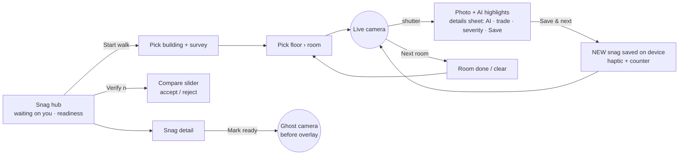
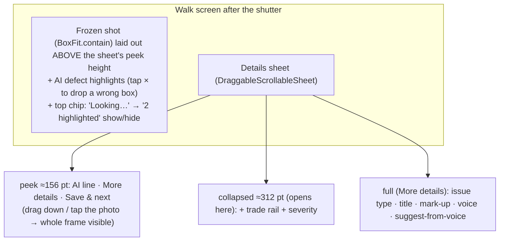
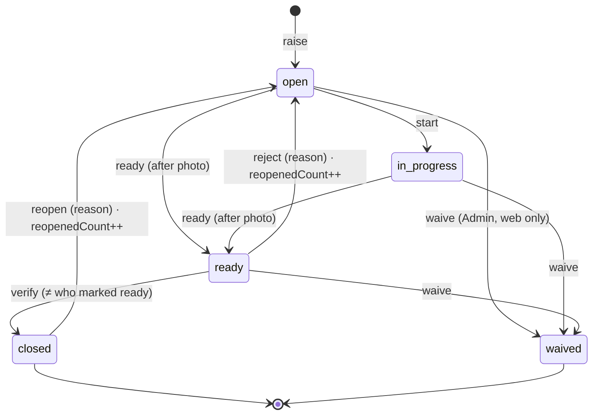
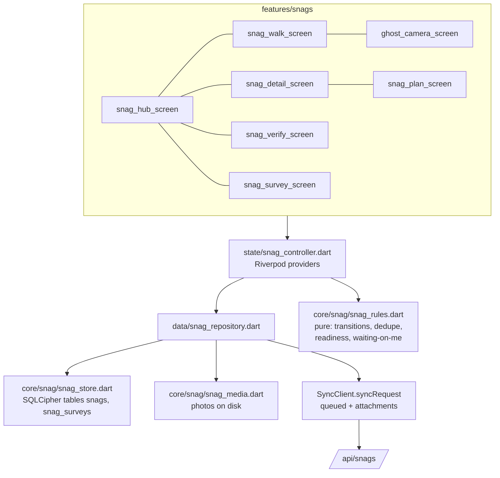
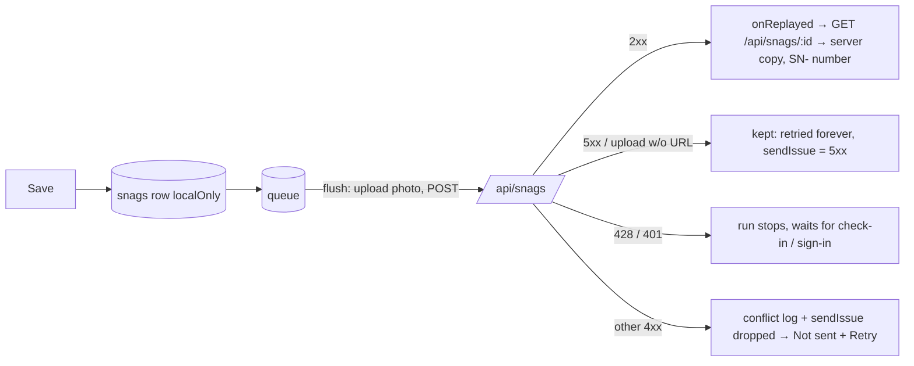
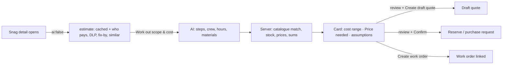
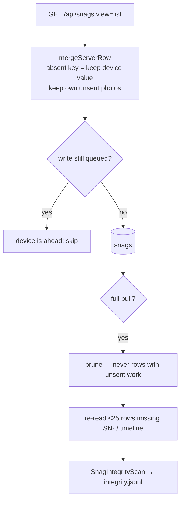
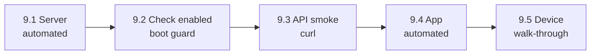

# Snag Assistant

A module in FieldOps for **snagging**: raising, fixing and verifying defects during construction punch-out, FM takeover (mobilisation) surveys, the defects liability period (DLP), and day-to-day operations. It is a peer of Work Orders, not part of them.

Status (2026-09-26): v1 built end to end. The app module is in `lib/features/snags/`, `lib/core/snag/`, `lib/data/snag_repository.dart` and `lib/state/snag_controller.dart`. The server side is `/api/snags` in `../fusion-eco-server`, documented in `../fusion-eco-server/documentation/snag-assistant.md`. `dart analyze` is clean, 39 Flutter tests pass, and the server's related suites pass 79/79 (§8; step-by-step testing in §9). Since 2026-10-06 snags need no manual server step: the server's boot schema guard enables snag storage on every database itself (§7.3), and the app no longer has a "not switched on for your site" state. The module has not yet been run on a device (PENDING P-001).
---

## 1. Research: what goes wrong with snagging today

Sources: Dalux, Fieldwire, PlanRadar, Procore and GoAudits product pages; FM mobilisation and DLP guides (links in §10); and our own `../features/C2O/FR-DALUX-FEATURE-MAPPING.md` §4.D/§4.D.1 (relative to the workspace root).

| # | Problem | Evidence | What the module does about it |
|---|---|---|---|
| P1 | **False completion.** Items are marked done that are not done. Trades mark items complete to get paid. | "The risk in any closeout isn't missing an item. It's having items marked complete that aren't." (ScanManifold). Rework is 4–10% of project cost (Constructable). | A snag can only move to **Ready** with an *after* photo. Only **someone else** can close it (second-party rule, enforced on the server). Reopens are counted. |
| P2 | **Duplicates.** Several inspectors walking the same corridor raise the same defect. This is how punch lists reach 3,000 items. | FR-DALUX §9.2; Fieldwire templates make copies easy. | Before saving, the app checks for **similar open snags nearby** (same room, same trade, similar words, or close pin). If it is the same defect, one tap adds the photo to the existing snag as "+1". |
| P3 | **Unclear location.** "Room 204" or "near the lift" makes the fixer search for it. | Constructable: vague descriptions waste field time. | The location is picked once per room in a walk (floor › room), with an optional pin on the floor plan, an optional asset, and a photo with arrow or circle markup. |
| P4 | **No signal where snags are found.** Basements, plant rooms, risers. | FR-DALUX §4.D.1: "Offline is not optional." | Offline-first. Every write is saved on the device first and synced later. No snag write depends on the network. |
| P5 | **Too slow to raise.** A surveyor raising 60–200 snags a day cannot fill in a form for each one. | Takeover surveys raise hundreds of items (FR-DALUX §4.D.1). | **Walk mode**: the camera stays open, and a snag takes one photo plus two taps (trade, severity), about 8 seconds. Optional voice note and AI suggestion. |
| P6 | **A room with no snags looks the same as a room nobody inspected.** Coverage is invisible, so a takeover survey can look complete when it isn't. | readinessService principle: unmeasured ≠ passed. | **Room sweep**: marking a room *Clear* records that it was inspected. Survey coverage is rooms inspected ÷ rooms in scope. |
| P7 | **Snag vs ticket confusion.** A defect found during a PM becomes extra scope on the work order and is never verified. | FR-DALUX §4.D.1: "The line between a Snag and a Ticket." | "Raise snag" from a work order or asset creates a separate snag linked to it. The snag closes only on verification, not when the work order closes. |
| P8 | **DLP evidence.** Retention is released without proof that each defect was reported, fixed and verified. | DLP guides: "The DLP is, above all, an evidence exercise." | Every snag keeps an append-only activity log (who, when, what, photos) and a before/after photo pair. The DLP context shows responsible party and due date. |
| P9 | **Inherited defects at takeover** are not recorded against the outgoing party, so the incoming FM contractor ends up owning them. | HFL/Oxmaint takeover guides: condition survey and inherited-defect ranking by safety risk. | `fm-takeover` context, a responsible-party field, and severity-weighted **Takeover readiness**. |

## 2. Who uses it (in this app)

FieldOps refuses partner (contractor) logins, so contractors close their own snags on the web partner portal. That is out of scope here. The app serves three roles, and one person often has more than one:

- **Inspector / surveyor.** Walks and raises snags: an FM takeover surveyor, the client's QA, or an in-house engineer doing a DLP round.
- **Fixer.** An in-house technician assigned a snag, mostly in the `operations` context. Starts the work and marks it Ready with an after photo.
- **Verifier.** Re-inspects Ready snags and accepts or rejects them. Must not be the person who marked the snag Ready.

## 3. Use cases, prioritised

**Must (v1, built)**

| ID | Use case | Actor | Why it matters |
|---|---|---|---|
| UC-1 | **Walk mode.** Choose building and survey, then floor and room. Take a photo, pick trade and severity, save, and keep going. The camera stays live, a film strip shows this room's snags, and **Next room** asks you to confirm the room is done. | Inspector | P5. The core of snagging. |
| UC-2 | **Room sweep.** Mark a room *Clear* (inspected, no snags) or *Done (n snags)*. Coverage is shown per floor. | Inspector | P6. Coverage is what makes a takeover survey believable. |
| UC-3 | **Duplicate guard.** On save **from the raise form**, similar open / in-progress snags are scored and shown side by side. *Same issue* adds the photo as +1 evidence (stage `extra`) and bumps "Also reported by". *Different* saves a new snag. Works offline over the local cache. **Walk mode does not run it** since 2026-10-10: one walk shot = one new snag (§6 "Integrity"). | Inspector | P2 |
| UC-4 | **Photo markup.** Arrow, circle or freehand over the photo, using the existing `PhotoAnnotationScreen`. | Inspector | P3 |
| UC-5 | **Quick snag from context.** From an asset or a work order, a pre-filled raise form: building, floor, room and asset are already set, and the work order is linked. | Technician | P7 |
| UC-6 | **Fix → Ready.** *Start fixing*, then *Mark ready*. Mark ready opens the **ghost camera**, which overlays the before photo on the live preview so the after photo is taken from the same angle. | Fixer | P1 |
| UC-7 | **Verify run.** A queue of Ready snags that I did not mark Ready. Each card has a before/after **compare slider**. *Accept* closes the snag. *Reject* reopens it with a reason chip plus an optional note and photo, and increments `reopenedCount`. | Verifier | P1, P8 |
| UC-8 | **Hub: "Waiting on you".** Snags to verify, snags assigned to me, and overdue snags I raised, with counts per context and building. | All | Tells each person what to do next. |
| UC-9 | **Survey dashboard.** Readiness ring, coverage by floor, severity and trade breakdown, and a room list: not visited, clear, or n snags. | Inspector / lead | P6, P9 |
| UC-10 | **Snag detail.** Before/after gallery, status stepper with reopen loops, location and responsible party, activity timeline, comment, add photo, show on floor plan. | All | P8 |
| UC-11 | **AI suggest (online).** From the photo, plus the optional voice note, the server proposes title, trade, issue type and severity. Suggestions are marked ✨ and never saved without a tap. Offline, the app suggests your most recently used trade and severity in this walk instead. | Inspector | P5. Nothing is written automatically, the same rule `criticalityService` follows. |
| UC-12 | **Pin on floor plan.** Drop a pin on the floor's plan image, which is cached for offline use. Existing snag pins are drawn and coloured by severity, so a duplicate shows up visually before it is raised. | Inspector | P2, P3 |
| UC-13 | **Offline-first with sync state per snag.** A "On device" badge until the server confirms. Conflicts go to the Sync Center. | All | P4 |

**Should (v1.1, designed, not built)**

- UC-14 **Spawn a work order from a snag** (`workOrderId` is stored; the create flow is web-only today).
- UC-15 **PDF punch list per trade or responsible party**, exported from the web office view (`pdfKit.ts` exists).
- UC-16 **DLP expiry banner**: "DLP ends in 23 days, 14 open". Needs a DLP end date per building or contract.
- UC-17 **Assign to a vendor from the app.** Today the app records a free-text responsible party; vendor assignment happens on the web.

**Won't (for now)**: contractor login in FieldOps (the partner portal covers it), 360°/splat pinning (§5 of FR-DALUX), and a daily site report.

## 4. UX concept

The main design choice is to be **camera-first, not form-first**. A snag is a photo with a label, not a form with a photo attached.



**Walk mode after the shot (redesign 2026-10-06, owner iPhone test: "overwhelming… the UI is fully blocked with no frame displayed").** The shot keeps the screen; the details are a draggable bottom sheet (`widgets/snag_walk_sheet.dart`, `SnagWalkComposeSheet`):



- The frame is never hidden: the photo area ends where the sheet's lowest resting height begins, so dragging down (or tapping the photo) shows all of it. While shooting, the live camera is full-screen as before, and the room/walk counters show only then.
- Save & next and "More details" are pinned to the sheet's foot at every height; discard is the ✕ in the top bar. Quick snag's flow (shutter → trade → severity → save) is unchanged and needs no drag.
- Typing a title expands the sheet to full height so the field stays above the keyboard. Sizes come from `SnagWalkSheetSizes.forHeight` (pure, tested from 300 pt — an SE with the keyboard up — to 1180 pt). Tested at 320×568 in English and Arabic (`test/snag_walk_sheet_test.dart`).

**AI defect highlights (2026-10-06).** AI assist also returns `regions` — boxes normalised to the photo (`{x,y,w,h,label,severity}`, server doc §4a "Regions"). `SnagRegion` (`domain/snag.dart`) re-grounds them exactly like the server (clamp, slivers and whole-photo boxes dropped, label = an issue type, ≤ 5). `widgets/snag_region_overlay.dart` draws them: colour by severity, a chip "Damage · Major", a short double pulse on first show (skipped with reduced motion), a show/hide toggle, and × to remove a wrong box. `snagRegionRect` maps normalised → pixels for `cover` and `contain`; photo space is never mirrored in RTL. They show on the create step (annotated photo in the AI panel), on walk mode's frozen shot, and on the detail screen's photo strip and full-screen viewer (read-only). The kept boxes are saved on the analysed photo's evidence item (`evidence[].regions`, first photo only, and only while it is still the photo the AI looked at).

Visual language: the existing soft-card kit (`TechCard`, `TechChip`, `IconBadge`, `ProgressRing`, `StaggeredEntrance`). Severity uses the existing priority hues: critical is `priorityCritical`, major is `priorityHigh`, minor is `priorityMedium`, cosmetic is `priorityLow`. Walk mode and the ghost camera are dark and immersive, like the scanner. Everything else is the light Navy Professional theme.

## 5. Lifecycle



API status to DB status on the shared findings table: `open→open`, `in-progress→in-progress`, `ready→resolved`, `closed→verified`, `waived→waived`. The existing enum already has all five, so no enum change is needed.

## 6. App architecture



**Local-first write path.** This is the same contract the rest of the app uses, applied to every snag write:

1. Build the change with the pure `SnagRules` (for example `applyTransition`), which enforces the same rules as the server.
2. Write the result to the local `snags` table straight away. The UI updates from `snagTickProvider`.
3. Call `syncRequest(...)` with `entityType: 'Snag'` and the snag id. Photos are `QueuedAttachment`s with a `__pending_snag_<evidenceId>__` placeholder.
4. If the request is synced, overwrite the local row with the server's copy (server id, URLs, `number`). If it is queued, the row keeps `localOnly=1` until a later list fetch returns it.

**Outbox first (2026-10-06).** Raising a snag, "+1"/extra photos and every survey write no longer try the network inline. They are written locally, then `SyncClient.queueRequest` parks them in the queue and kicks a flush in the background (a flush already running re-runs once at the end). Save returns in milliseconds; the card shows the honest state. Transitions (start/ready/verify/reject) stay online-first so a refusal such as `409 SELF_VERIFY` is seen at once; if one fails without queuing, the optimistic change is rolled back.



**Send states** (`core/snag/snag_send_state.dart`, pure): Synced · Sending… · Waiting to send (no signal / check-in / sign-in / server not ready — each with a plain reason) · Not sent (refused, or stranded by an older build) with Retry. Card flag, detail banner and walk film-strip dot all use it. `SnagRepository.afterReplayFailed` records `{status, code, dropped}` on the snag row (`sendIssue`, local only).

**Why it used to look "saved locally but never persisted"** (iPhone report 2026-10-06): (1) a queued create that synced kept `localOnly=1` until the hub happened to pull that building — no replay follow-up was registered for snags; (2) any non-5xx failure on the inline online path (upload refused, upload answered without a URL) left the snag on the phone with nothing queued; (3) a 5xx (e.g. `503 SNAG_ENGINE_NOT_ENABLED`) was dropped to the conflict log after 5 polls ≈ 100 s; (4) iOS moves the app container on every app update, so stored absolute photo paths broke (`SnagMedia.reroot` now re-roots on `snag_media/`).

**Speed.** Buildings and room trees are cache-first with background revalidation. Building pulls ask `view=list` (no `activity`) and, after one full pull, `updatedSince=<last serverTime − 2 min>`; a full pull (with prune) runs at most every 6 h. Rows are written in one batch (`SnagStore.upsertSnags`). The hub list is lazy (slivers); thumbnails are memoised and decoded at display size. The detail screen opens from the local row and reads the full snag in the background.

**AI estimate & quote help (2026-10-10) — the main AI help on a snag.** The owner's direction: photo analysis is not the headline; the AI should work out what the fix needs and roughly what it costs, and help prepare a quote. The snag detail screen has an "Estimate & quote" card (`features/snags/widgets/snag_estimate_card.dart`, model `domain/snag_estimate.dart`, online-only `data/snag_estimate_repository.dart`; server doc §4c):

- On open it asks `POST /api/snags/:id/ai/estimate` with `ai:false` — quick, no AI wait. It shows a cached estimate if one exists, plus the parts that need no AI: who pays (contractor / warranty / facilities team, with a back-charge pill), DLP / warranty, the suggested priority (**Apply**), a fix-by date from the SLA policy (**Set as due**), and similar past snags (count, median days, cost range).
- **Work out scope & cost** asks the AI (~15–25 s): steps, trades, crew and hours, materials matched to the catalogue with stock ("3 free" / "short 2"), and an approximate cost range (labour + materials + contingency) with every assumption listed. **Every amount is the server's.** A material it can't price shows **Price needed**, never a guess, and the total says what's left out.
- **Prepare quote** opens a review sheet: tick/untick lines, fill in any missing price (the button stays off until every included line has one), **Create draft quote** → a Draft in the office's Quotes, linked on the snag's thread. **Reserve / request materials** (catalogue items only): reserve from stock or raise a purchase request per line. **Create work order** (when none is linked): a WO with the scope steps, technician matched by trade.
- Each approval mints one `requestId` per sheet and reuses it on retry, so a double tap returns the first quote/WO. Nothing is queued offline — these are decisions made while looking at live numbers; offline the card says it needs a connection.



**Photo check is optional (2026-10-10).** The create step and walk mode no longer ask the AI about the photo by themselves. The create step shows one small **Check photo** chip (`SnagAiPanel`); walk mode shows the chip on the frozen shot, and its details-sheet strip appears only after the technician asked. Highlights (`regions`) still come with the answer.

**AI assist (2026-10-06, now on request — see above).** After the first photo the create screen asks `POST /api/snags/ai/assist` (server doc §4a) in the background: suggestions for title, trade, severity, issue type, description, likely cause, fix and who should fix it, each with Apply (and Apply all); photo tips (dark/blurry are measured on the phone, `core/snag/snag_photo_quality.dart`, so they work offline); open snags nearby that look the same; and what is still missing. Fields set from it carry an "AI suggested" badge until edited. Walk mode shows the AI strip at the top of its details sheet and ✨ marks on the chips. Since 2026-10-06 it also highlights where the defect is on the photo (`regions`, see §4 "AI defect highlights"); the server waits up to 15 s for the engine and the app 24 s. Offline it says "AI assist needs a connection. Your snag still saves." Nothing is saved without a tap.

**Merge on read.** The server's copy of a snag replaces the local copy unless that snag still has a pending mutation in the queue, in which case the local copy is ahead and wins. Snags that exist only locally are kept. A server-side rejection (a 4xx such as `409 SELF_VERIFY`) goes to the conflict log through the normal flush policy, and the refused snag is re-read from the server at once (a delta pull never would: the server row did not change). Since 2026-10-10 "replaces" means **field by field** — see "Integrity" below.

**Integrity (2026-10-10, owner iPhone report).** Two reports: "I captured one photo in walk mode … it got added to an existing snag's after-photos" and "some snags were not visible, some status and metadata missing". Causes and rules:

| Cause | Rule now | Where |
|---|---|---|
| Walk Save & next ran the duplicate guard. Room + trade + the default type `defect` = 0.65 ≥ 0.6, so most shots in a room with another live same-trade snag opened "Already raised?"; its primary button put the shot on THAT snag (ready ones included, beside their after-photos) and raised nothing — the walk's snag never existed. | One walk shot = one new snag (`saveShot(mode: walk)`); the guard runs on the raise form only, offers open / in-progress snags only, and a "+1" goes only to the snag picked if it is still a candidate. | `SnagRepository.saveShot`, `SnagDuplicateFinder.find` |
| Screens hand writes a `Snag` built minutes earlier (Mark ready waits on the camera); writing on top of it put back the old status, photos, timeline. | Every write re-reads the newest local copy (`_fresh`). | `transition`, `addEvidence`, `comment` |
| A draft id already on the phone replaced that other snag's row. | `raise` refuses it (StateError + log). | `raise` |
| A pull replaced the evidence list wholesale: the device's own photo the server never got (upload refused, placeholder never swapped) vanished. A missing key in a list row blanked the field. | `mergeServerRow`: keys the row does not carry keep the device value (explicit `null` still clears); own captures filed under `own/<thisSnagId>/` that the server lacks are kept. | `mergeServerRow`, `mergeEvidence` |
| A refused change left the optimistic status for up to 6 h (delta pulls never resend an unchanged row). | Dropped write → re-read server copy, keep the "Not sent" issue. The sync client now reports a drop after deleting it from the queue. | `afterReplayFailed`, `SyncClient.flushQueue` |
| Full-pull prune could delete a server-known row holding unsent work. | Rows with local-only photos or a send issue are never pruned. | `refresh` |
| A device clock moved backwards kept every pull a delta. | Negative "since last full pull" → full pull. Cursor key bumped to `snag.cursor.v2.*` so every device does one full pull after updating. | `refresh` |
| Lean rows (no timeline) for snags new to the phone. | Each full pull re-reads up to 25 rows missing their SN- number or timeline. | `_repairAfterFullPull` |
| A reused thumbnail widget showed the previous snag's photo while the new lookup ran. | `SnagPhoto`'s `FutureBuilder` is keyed by evidence. | `snag_visuals.dart` |

Server side (same day): `/evidence` can never add after-photos (`after` → `extra`), evidence appends are idempotent on id, an evidence id already on another snag is `409 EVIDENCE_ID_CONFLICT`, lean lists omit `activity` instead of sending `[]`, and `updatedSince` is inclusive — server `docs/kb/learnings/2026-10-10-snag-walk-shot-misfiled-and-list-merge.md`.

**Developer integrity log** (never shown to users): `snag_media/diag/integrity.jsonl`, one JSON event per line, capped at 500, kept across sign-out; `[snag-integrity]` lines in debug builds. Kinds: `id-reused`, `stale-write-avoided`, `device-only-evidence-kept`, `prune-kept`, `repaired-from-server`, `refused-write-resynced`, `clock-skew-full-pull`, and the two the full-pull scan reports without changing anything — `possible-misattached` ("+1" photos this person added through the duplicate guard: the walk shots of the report) and `after-photo-without-ready` (an after-photo whose taker never marked that snag ready). Read it with `SnagRepository.integrity.read()`.



**Ids.** The client mints UUIDs for snags, evidence and surveys, so replays are idempotent: `POST /api/snags` with an existing id returns the existing row. The human reference `SN-00042` is assigned by the server. Until the server assigns it, the app shows `#` plus the first 6 characters of the id.

**Server 5xx.** Snag and survey writes are in `kKeepOnServerErrorEntityTypes` (`flush_policy.dart`): a 5xx keeps them queued indefinitely instead of dropping them after `maxMutationAttempts`, so a server that is not yet enabled for snags (503) cannot lose a walk. `SnagRepository.resendStranded()` still re-queues creates an older build gave up on, once `GET /api/snags/engine` reports enabled — but never one the server refused (4xx); those wait for Retry.

**Photos offline.** Photos are stored under `snag_media/` in the app documents directory. `SnagMediaCache` downloads the photos of open and ready snags in a building for offline verification ("Download for offline" in the hub).

**Location gate.** Snag POSTs carry their own capture time and GPS, so the server exempts them from the 428 check-in gate, as it already does for C2O verify and tag-issue (SR-5 reasoning). Replaying 60 queued snags after a basement walk cannot turn into 60 blocked writes.

## 7. Server contract (summary)

Full detail: `../fusion-eco-server/documentation/snag-assistant.md`.

### 7.1 Storage

Snags are rows in the **existing `c2o_findings` table**, with `source='field'`. This is the §4.D.1 "one engine, several front doors" decision: construction snags land in the same exception log and handover gate as rule findings. The new columns are all nullable or defaulted, so the boot-time schema guard adds them: `source, context, issueType, trade, priority, title, snagNumber, buildingId, floorId, spaceId, locationText, locationPin, assetName, surveyId, workOrderId, responsibleParty, assignedToUserId, assignedToVendorId, assigneeName, dueDate, evidence, activity, reopenedCount, reportCount, raisedBy, raisedByName, readyBy, readyAt, verifiedBy, verifiedAt, clientCreatedAt`. Surveys are a new table, `snag_surveys`, which the guard creates.

The C2O code that re-validates packages (`loadPriorFindings` and `resolveStaleFindings` in `runStore.ts`) now touches only rule-sourced rows, so a validation run can never auto-resolve a field snag.

### 7.2 Endpoints (all `decodeToken`)

| Method | Path | Purpose |
|---|---|---|
| GET | `/api/snags/locations/buildings` | building list |
| GET | `/api/snags/locations/buildings/:id` | lean floors › rooms tree, cached for walks |
| GET | `/api/snags` | list (`buildingId, context, surveyId, status, assetId, workOrderId, limit`) |
| GET | `/api/snags/summary` | counts by status, severity and trade, plus overdue |
| GET | `/api/snags/:id` | detail |
| POST | `/api/snags` | create (idempotent on the client `id`) |
| PATCH | `/api/snags/:id` | edit fields |
| POST | `/api/snags/:id/transition` | `start · ready · verify · reject · reopen · waive` |
| POST | `/api/snags/:id/evidence` | add photos; `duplicateReport:true` = "+1" |
| POST | `/api/snags/:id/comments` | activity comment |
| POST | `/api/snags/assist` | AI suggestion from photo (+ audio) |
| GET/POST | `/api/snags/surveys` | list / create (idempotent) |
| GET | `/api/snags/surveys/:id` | survey + sweep |
| POST | `/api/snags/surveys/:id/spaces` | room sweep upsert |
| POST | `/api/snags/surveys/:id/complete` | close survey |

### 7.3 Snag storage is enabled automatically (no manual step since 2026-10-06)

`c2o_findings."runId"` and `"packageId"` were `NOT NULL`, and a field snag has neither. Until 2026-10-06 that needed a manual `npm run findings:promote -- --apply`; any server where nobody ran it answered `503 SNAG_ENGINE_NOT_ENABLED`, and the phone said "Snags aren't switched on for your site yet" while still letting the technician raise snags (owner's iPhone test). Now the server's boot schema guard relaxes exactly those two columns itself (idempotent, no row touched; server `documentation/boot-schema-guard.md` step 5), and retries on the next snag write if boot could not. There is no per-site switch for snags.

The app no longer has a "not switched on" state: a 503 from an older server is shown like any other server hiccup ("Couldn't send yet. It's safe on this phone and keeps trying by itself."), and the write stays queued (`kKeepOnServerErrorEntityTypes`). A snag waits only for real reasons: no signal, the location check-in, or sign-in.

## 8. Tests

These ran on Flutter 3.47.5 / Dart 3.13.4, bootstrapped in the session scratchpad (LEARNINGS → Platform), on 2026-09-26.

| File | Covers | Result |
|---|---|---|
| `test/snag_rules_test.dart` | transitions and the second-party rule, duplicate scoring (including different-room exclusion), readiness with unmeasured dimensions, waiting-on-me order, floor coverage | 17/17 |
| `test/snag_model_test.dart` | tolerant DTO parsing, placeholder URLs dropped, capture time over insert time, local round-trip, route builders | 12/12 |
| `test/snag_widgets_test.dart` | card, severity pills, stepper and compare slider in EN and AR at 320 px; no raw i18n keys | 4/4 |
| `test/snag_screens_test.dart` | hub (scrolled end to end), detail (accept/reject for a ready snag), and survey dashboard in EN and AR at 360 px, with providers overridden | 6/6 |
| server `snagRules.test.ts`, `runStore.test.ts` (fence), `authLocationGate.test.ts` (exemption) | status mapping, guards, sanitising, never auto-resolving a field snag, 428 exemption for POST only | 79/79 across 8 files |
| `test/snag_integrity_repro_test.dart` (2026-10-10) | reproducers for the owner's report: ready snag offered as duplicate, id reuse replacing another snag, stale-copy write, own photo dropped by a pull, refused change never restored under deltas, prune of unsent work, clock-skew deltas, lean timeline never repaired, absent list key blanking a field | 9/9 (all 9 failed on HEAD `5c2006c`) |
| `test/snag_integrity_test.dart` (2026-10-10) | `saveShot` walk vs raise form, integrity log (dedupe, cap, id reuse), full-pull scan, pure merge helpers | 11/11 |
| server `snagRules.test.ts` `appendEvidence` (2026-10-10) | replay appends nothing, `/evidence` never makes after-photos | 21/21 in file |

`dart analyze` on the whole app reports only the 6 infos that were there before this module. There is no widget test for the walk, raise, verify or ghost-camera screens, because they need the camera plugin; a device run is still owed (PENDING P-001).

The full `flutter test` run showed three failures outside this module. `dates_test` ("ignores earlier today") depends on the clock around midnight. `qr_payload_test` depends on the environment. `order_detail_test` "per-type headings" hangs in the test's own `FlutterLocalization.ensureInitialized()` and never builds the screen this module touched. All three reproduce on an unmodified `git archive HEAD` copy; PENDING P-003 tracks them.

## 9. How to test it

Work top to bottom: each stage assumes the one before it passed. You need **two technician logins**. A is the surveyor who raises and verifies. B is the fixer. Two different people matter because the server refuses to let the person who marked a snag ready also verify it.



### 9.1 Server: automated checks

The server does not need to be running. From `../fusion-eco-server`:

```bash
npx vitest run src/services/__tests__/snagRules.test.ts \
  src/services/validation/persistence/__tests__/runStore.test.ts \
  src/middleware/__tests__/authLocationGate.test.ts
npx tsc --noEmit -p . 2>&1 | grep -i "snag\|c2o-finding\|runStore\|middleware/auth"   # expect no output
```

**Expected:** all tests pass. `snagRules` covers the guards, `runStore` covers the "never auto-resolve a field snag" fence, and `authLocationGate` covers the 428 exemption for snag POSTs. The `grep` prints nothing. The rest of the repo already has about 470 unrelated `tsc` errors, from Express 5 param typing.

### 9.2 Snag writes are enabled at boot (check once per database)

1. Start the server with this code (`npm run dev`). The boot schema guard adds the `c2o_findings` snag columns, creates `snag_surveys`, and (step 5) relaxes `runId`/`packageId` to NULL-able. On a database that still had them NOT NULL the log shows `[schema]   ~ c2o_findings.runId DROP NOT NULL …` (and `packageId`); on later boots nothing.
2. `GET /api/snags/engine` returns `{"enabled": true}` (see 9.3). `npm run findings:promote` (dry run) should now list both columns as `nullable`.
3. Only if the database opts out of the guard (`DB_AUTO_ENSURE_SCHEMA=false`): run `npm run findings:promote -- --apply` by hand, as before.

### 9.3 API smoke test (curl)

Set up tokens and IDs. Use `technician-login` for technicians, and put your own credentials in:

```bash
API=http://localhost:5002
A=$(curl -s -X POST $API/api/auth/technician-login -H 'Content-Type: application/json' \
  -d '{"username":"<techA>","password":"<pwA>"}' | jq -r .token)
B=$(curl -s -X POST $API/api/auth/technician-login -H 'Content-Type: application/json' \
  -d '{"username":"<techB>","password":"<pwB>"}' | jq -r .token)
H() { echo "Authorization: Bearer $1"; }
J='Content-Type: application/json'
id() { uuidgen | tr A-Z a-z; }

curl -s $API/api/snags/engine -H "$(H $A)"                        # {"success":true,"data":{"enabled":true}}
BLD=$(curl -s $API/api/snags/locations/buildings -H "$(H $A)" | jq -r '.data[0].id')
curl -s $API/api/snags/locations/buildings/$BLD -H "$(H $A)" | jq '.data.floors[0] | {name, spaces: (.spaces|length)}'
PHOTO=$(curl -s -X POST $API/api/upload/image -H "$(H $A)" -F image=@crack.jpg | jq -r .data.url)
```

Then run each step and compare with the expected result:

| # | Step | Command | Expected |
|---|---|---|---|
| a | A raises a snag | `S=$(id); curl -s -X POST $API/api/snags -H "$(H $A)" -H "$J" -d "{\"id\":\"$S\",\"context\":\"fm-takeover\",\"trade\":\"plumbing\",\"priority\":\"major\",\"title\":\"Leak under basin\",\"buildingId\":\"$BLD\",\"evidence\":[{\"id\":\"$(id)\",\"kind\":\"photo\",\"stage\":\"before\",\"url\":\"$PHOTO\"}]}" -w '%{http_code}\n' \| tail -c 200` | `201`, `reference` `SN-000nn`, `status` `open`, `severity` `warning` |
| b | Replay the same body (as if the offline queue retried) | same command again | `200`, same `reference`, no second row |
| c | B marks it ready **without** an after photo | `curl -s -X POST $API/api/snags/$S/transition -H "$(H $B)" -H "$J" -d '{"action":"ready"}'` | `422`, `AFTER_PHOTO_REQUIRED` |
| d | B marks it ready with an after photo | `curl -s -X POST $API/api/snags/$S/transition -H "$(H $B)" -H "$J" -d "{\"action\":\"ready\",\"evidence\":[{\"id\":\"$(id)\",\"kind\":\"photo\",\"stage\":\"after\",\"url\":\"$PHOTO\"}]}" \| jq .data.status` | `"ready"`. A gets a "Snag ready for verification" notification. |
| e | B tries to verify their own fix | `... transition -H "$(H $B)" ... -d '{"action":"verify"}'` | `409`, `SELF_VERIFY` |
| f | A rejects without a reason, then with one | `-d '{"action":"reject"}'`, then `-d '{"action":"reject","reason":"Still dripping"}'` | `422 REASON_REQUIRED`, then `status` `open`, `reopenedCount` `1` |
| g | B marks ready again (as in d) and A verifies | `... -H "$(H $A)" ... -d '{"action":"verify"}'` | `status` `closed`, `verifiedBy` = A, `closedAt` set |
| h | Verify again (a replay) | same as g | `409 INVALID_TRANSITION`. Never a silent 200. |
| i | Someone reports the same defect ("+1") | `curl -s -X POST $API/api/snags/$S/evidence -H "$(H $B)" -H "$J" -d "{\"duplicateReport\":true,\"evidence\":[{\"id\":\"$(id)\",\"kind\":\"photo\",\"stage\":\"extra\",\"url\":\"$PHOTO\"}]}" \| jq .data.reportCount` | `2` |
| j | Evidence with an un-uploaded placeholder is ignored | the same with `"url":"__pending_snag_x__"` and no other photo | `400`: "Send at least one photo or a note" |
| k | Survey and room sweep | `W=$(id); curl -s -X POST $API/api/snags/surveys -H "$(H $A)" -H "$J" -d "{\"id\":\"$W\",\"name\":\"Test walk\",\"buildingId\":\"$BLD\"}"`, then `curl -s -X POST $API/api/snags/surveys/$W/spaces -H "$(H $A)" -H "$J" -d '{"spaceId":"<a space id from the tree>","snagCount":0}'` (`clear` is derived from `snagCount` when omitted), then `GET /api/snags/surveys/$W` | `201`; `inspectedSpaces` has one entry with `clear:true`; sweeping the same room again replaces that entry and does not add a second |
| l | List and summary | `GET /api/snags?buildingId=$BLD&status=open,ready` and `GET /api/snags/summary?buildingId=$BLD` | `items`/`total`; the summary counts match what you created |
| m | AI assist (needs `GEMINI_API_KEY`) | `curl -s -X POST $API/api/snags/assist -H "$(H $A)" -H "$J" -d "{\"image\":\"data:image/jpeg;base64,$(base64 -i crack.jpg)\",\"context\":\"fm-takeover\"}" \| jq .data` | `title`, `trade`, `priority` and `confidence` suggested, all within the vocabulary. The list `total` is **unchanged**: assist never writes. |
| n | Waive is admin only | on any open snag: `curl -s -X POST $API/api/snags/<id>/transition -H "$(H $A)" -H "$J" -d '{"action":"waive","reason":"x"}'` | `403 WAIVE_FORBIDDEN` |
| o | The location gate does not block snag POSTs | with technician A's last check-in older than 24h, repeat a | still `201`. A `PATCH /api/snags/$S` returns `428`. |

**Read-only DB check** (optional, safe on the shared DB):

```sql
SELECT "snagNumber", status, source, severity, "reopenedCount", "reportCount", jsonb_array_length(activity) AS events
FROM c2o_findings WHERE source = 'field' ORDER BY "createdAt" DESC LIMIT 5;
```

For the snag from steps a–i you should see `status = verified`, `reopenedCount = 1`, `reportCount = 2` and `events` = 6: raised, ready, rejected, ready, verified, duplicate-report. The refused attempts in c, e and h write nothing.

### 9.4 App: automated checks

This needs Flutter ≥ 3.44. Check `flutter --version`: the `a2251` Mac has 3.47.6 since 2026-10-05. On a machine below 3.44, bootstrap it first: LEARNINGS → Platform, 2026-09-26.

```bash
flutter pub get --enforce-lockfile
flutter analyze                     # expect only the 6 pre-existing infos
flutter test test/snag_rules_test.dart test/snag_model_test.dart \
  test/snag_widgets_test.dart test/snag_screens_test.dart          # expect 39/39
```

Don't use a full `flutter test` run to judge this module. `order_detail_test` hangs for 10 minutes per case, and two other tests fail on unmodified HEAD (PENDING P-003).

### 9.5 Device walk-through (Android)

Build against the server you enabled in 9.2:

```bash
flutter run --dart-define=API_BASE_URL=http://<lan-ip>:5002 --dart-define=WEB_BASE_URL=http://<lan-ip>:3000
```

To prepare, pick a building that has floors and rooms, one floor with a plan image, one asset, and one open work order. Sign in on the phone as **A**.

| # | Do | Expect |
|---|---|---|
| 1 | Dashboard → **Snag Assistant** card | The hub opens on the building (it is remembered next time). The cloud badge is green. The readiness ring shows "—" on a building with no snags, or a percentage if 9.3 left some. |
| 2 | Tap **Download for offline** in the header | A toast reports how many photos are available offline. The room tree and floor plans are cached too. |
| 3 | **Start walk** → pick *FM takeover* → start | Live camera. The room picker opens on its own. Pick a room. |
| 4 | **Airplane mode on.** Shoot → tap a trade chip → a severity → **Save & next** | A haptic buzz and a "Saved on this device" toast. You are back at the camera immediately. The thumbnail appears in the film strip and the "Room 1 / Walk 1" counters go up. |
| 5 | Raise 4 more in the same room. Use **Mark up** once (circle something) and **Voice note** once | Each takes seconds. The next shot pre-selects the last trade used. |
| 6 | **Room done (5)** → next room → **Room clear** straight away | A "…checked · 5 snags" toast, then "…marked as checked and clear". In the room picker, the first room shows ⚠ 5 and the second ✓. |
| 7 | Tap ✨ **Suggest** while offline | "The assistant needs a connection…". Saving still works. |
| 8 | **Finish** | The survey dashboard: coverage by floor (2 of *n* rooms), snags by severity and trade, and the list. Every snag is marked "On device". |
| 9 | **Airplane mode off.** Wait about 20 s, or open **Sync Center** | The queue drains ("Raise snag", "Room checked…"). Back on the hub, the "On device" badges disappear and references turn from `#1a2b3c` into `SN-000nn`. |
| 10 | Online: hub → **Quick snag**. Pick the **same room** as step 4, the same trade, and a title close to an existing one. (Walk mode deliberately skips your own snags from the same walk, so use Quick snag or sign in as B.) | The **Already raised?** sheet shows both photos side by side. Tap **Same issue — add my photo**: no new snag is created, and the existing one shows ×2. |
| 11 | Online: shoot → ✨ **Suggest** | Chips marked ✨ appear for trade, severity and title. Nothing is saved until you tap Save. |
| 12 | Asset detail → **Raise snag** | The form opens pre-filled with the asset and its floor. Pick a room and **Pin on floor plan**: existing snags appear as coloured dots, and tapping drops a pin. Save opens the new snag's detail. |
| 13 | Work order detail → **Raise snag** | The banner reads "Found during work… linked to the work order", and the detail shows the work order link. |
| 14 | Sign in as **B**. Open one of A's snags → **Start fixing** → **Mark ready** | The **ghost camera** shows A's before photo faded over the live view, with an opacity slider. Line it up and shoot. Status becomes Ready. A gets a push: "Snag ready for verification". |
| 15 | As B, open the same snag again | No Accept or Reject; instead, "Someone else has to verify your fix". |
| 16 | As **A**: pull to refresh the hub → **Verify** | The verify run shows 1 / *n*, with the compare slider to drag across. **Reject** → pick "Partly fixed" → it leaves the queue. Then Accept the next one. The summary counts accepted, rejected and skipped. |
| 17 | Open the rejected snag | The stepper shows ↺1. The timeline reads raised → started → marked ready → rejected (with the reason). |
| 18 | Tap the push notification from step 14 on a locked phone | It opens that snag's detail. |
| 19 | Dashboard language switcher → **العربية**, then revisit the hub, walk, detail and verify | Everything reads right to left. No raw `snags.…` keys, and no yellow-black overflow stripes. |
| 20 | Negative: run steps 3–4 **online** against a server **before** 9.2 step 3 | "Saved on this device". The server's 503 is queued, not shown as an error, and the Sync Center shows it retrying. After `--apply`, either the next retry succeeds, or, if it already ran out of retries, pull to refresh on the hub and `resendStranded` re-queues it. Either way it gets an `SN-` number. |

Record anything that fails against PENDING P-001, with the step number.

## 10. Open items

- ~~Run `findings:promote -- --apply` on each environment (§7.3).~~ Done automatically by the server's boot guard since 2026-10-06.
- The known queue P1s apply to snags as to every other write: logout wipes the queue, and a 5xx on a create can let a queued transition replay first. The transition then 404s into the conflict log, and the next fetch heals it.
- UC-14 to UC-17 in §3.
- The web office view (`app/facility-management/snags`) and the partner portal surface.

## 11. Sources

- [Fieldwire punch list](https://www.fieldwire.com/punch-list-app/) · [Procore punch list](https://www.procore.com/project-management/punch-list) · [GoAudits: best punch list apps](https://goaudits.com/blog/punch-list-app/)
- [Constructable: punch lists without delays (2026)](https://constructable.ai/blog/construction-punch-lists-avoid-delays)
- [ScanManifold: photo-required closeout](https://www.scanmanifold.com/blog-posts/punch-list-app-photo-required-closeout-contractors-2026)
- [QIC: best snagging apps 2026](https://qualityinconstruction.com/best-apps-for-construction-snagging/)
- [Oxmaint: FM takeover 120-point checklist](https://oxmaint.com/industries/facility-management/property-handover-fm-takeover-checklist-120-point) · [HFL: FM mobilisation and takeover](https://hflbuildingsolutions.co.uk/2025/06/19/a-comprehensive-guide-to-facilities-management-contract-mobilisation-and-takeover/)
- [OpenConstructionERP: DLP tracking](https://openconstructionerp.com/cases/defects-liability-period-tracking) · [Mastt: DLP explained](https://www.mastt.com/blogs/defects-liability-period)
- [Yalla Fix It: common Dubai handover defects 2025](https://www.yallafixit.ae/blog/common-defects-snagging-dubai-uncovers-by-developer-2025-database/)
- Internal: `../../features/C2O/FR-DALUX-FEATURE-MAPPING.md` §4.D, §4.D.1, §9.2.
